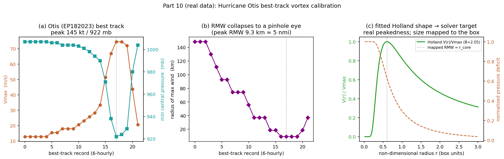
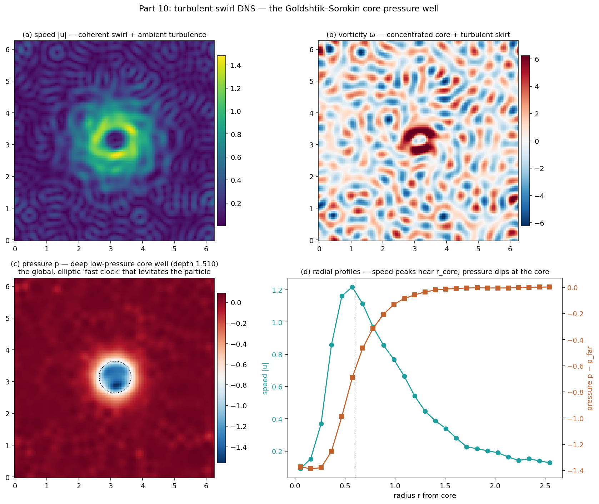
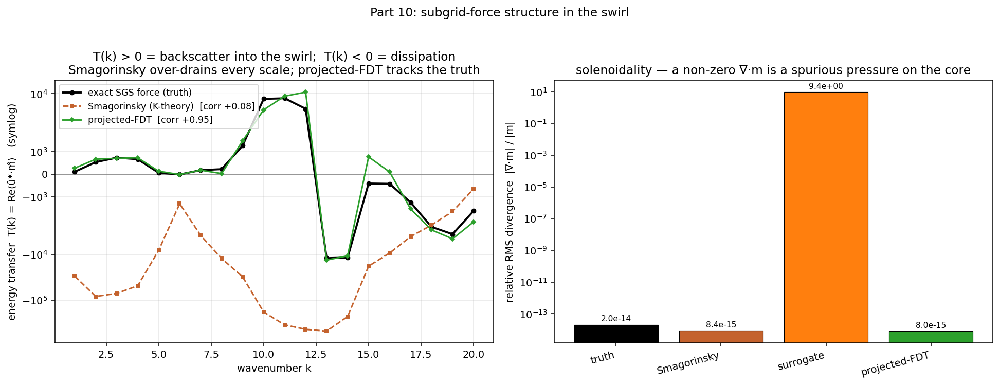
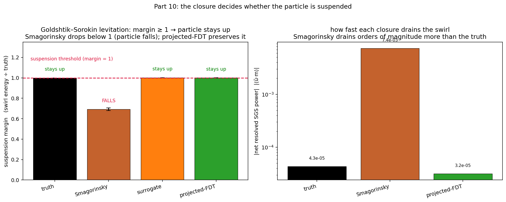

<!-- Benchmark section below is GENERATED by run_swirl.py --swirl otis
     (n=128, kc=20, steps=4000). Re-run to refresh numbers. Hand-written content
     below the marker is preserved. -->

# Part 10 (real data) — the closure test at a *Hurricane Otis*-calibrated vortex

This is the real-data calibration of Part 10, mirroring Part 9's BEDMAP1 real-bed
variant. The idealized run (`REPORT_SWIRL.md`) uses a synthetic Gaussian-core
vortex; here the swirl's **target tangential profile is taken from Hurricane Otis**
(EP182023), the record-breaking category-5 that struck Acapulco on 25 Oct 2023.

**Calibration (figure 44).**

From the NHC best track (HURDAT2, bundled in
`swirl/data/otis_besttrack.csv`) we read Otis's peak-intensity vortex:

| quantity | Otis (peak, 2023-10-25T03:00Z) |
|---|---|
| minimum central pressure p_c | **922 mb** |
| environmental pressure p_env | 1007 mb |
| pressure deficit Δp = p_env − p_c | **85 mb** |
| maximum sustained wind Vmax | 145 kt (74.6 m/s) |
| radius of maximum wind RMW | **5 nmi (9.3 km)** |
| mean 34-kt wind radius | 55 nmi |
| fitted Holland shape parameter B | **2.05** |

The Holland (1980) parametric vortex is fitted to the real wind–pressure relation
(B = ρ·e·Vmax²/Δp ⇒ B ≈ 2.05), giving the radial *shape* — how
sharply the swirl peaks at the eyewall and how deep the core pressure deficit is.
That shape is handed to the solver as its sustained target (RMW mapped to the
resolvable core radius r_core ≈ 0.60); turbulence is then developed on
top over 4000 steps. The measured core well depth is **1.510**.

## Calibrated vortex and its core well (figure 45)

The Otis-fitted vortex develops the same deep, global (elliptic) low-pressure core
well — the structure that would levitate a particle (Goldshtik–Sorokin) and exactly
the kind of nonlocal response the two-clocks thesis says K-theory cannot see.

## Energy transfer, solenoidality, suspension margin (figures 46–47)

| model | rel. RMS(∇·m) | transfer corr. | net resolved SGS power ⟨ū·m⟩ | suspension margin | verdict |
|---|---|---|---|---|---|
| truth | 2.03e-14 | 1.000 | -4.33e-05 | 1.000 | suspended (calibration) |
| Smagorinsky | 8.44e-15 | +0.064 | -7.36e-03 | **0.692** | **particle falls** |
| surrogate | 9.37e+00 | -0.230 | -9.00e-08 | 1.002 | ∇·m≠0 → spurious core pressure |
| projected-FDT | 8.02e-15 | +0.960 | -3.16e-05 | 1.000 | stays up |

**The Part-8b/Part-10 result survives real-vortex calibration.** With Otis's
measured Holland shape, a purely dissipative K-theory closure still over-drains the
swirl — at **170×** the truth's net rate — so the suspension margin
falls to **0.692 < 1** (particle falls). Projected-FDT preserves
the swirl energy and the core well (margin ≈ 1.00); the
spectrum-matched surrogate keeps the net energy budget but breaks ∇·m = 0, injecting
a spurious pressure on the very core well it must preserve.

## Scope and honesty (real-data variant)

The real data calibrate the **mean vortex geometry** (Otis's Holland B, its
deficit-to-wind relation, its tight-eye peakedness) — *not* the subgrid closure,
which is exactly what is under test. As in Part 9's real-bed run, the measured
profile is **non-dimensionalised** to the spectral box: Otis's real ≈9 km
pinhole eye is sub-grid at n=128, so absolute size and speed are rescaled while the
radial *shape* is preserved. Everything else inherits Part 10's caveats — a **2D,
frozen-field, a-priori** mechanism demo with a **force-balance** suspension proxy
(not an integrated Lagrangian trajectory), no 3D vortex stretching, and a margin
calibrated so the truth marginally suspends the particle (only the *relative*
ordering of closures is meaningful). This grounds the vortex geometry in a real
storm; it is **not** a hurricane forecast or an operational levitation prediction.
<!-- BEGIN HAND-WRITTEN CONTENT (preserved across regeneration) -->
