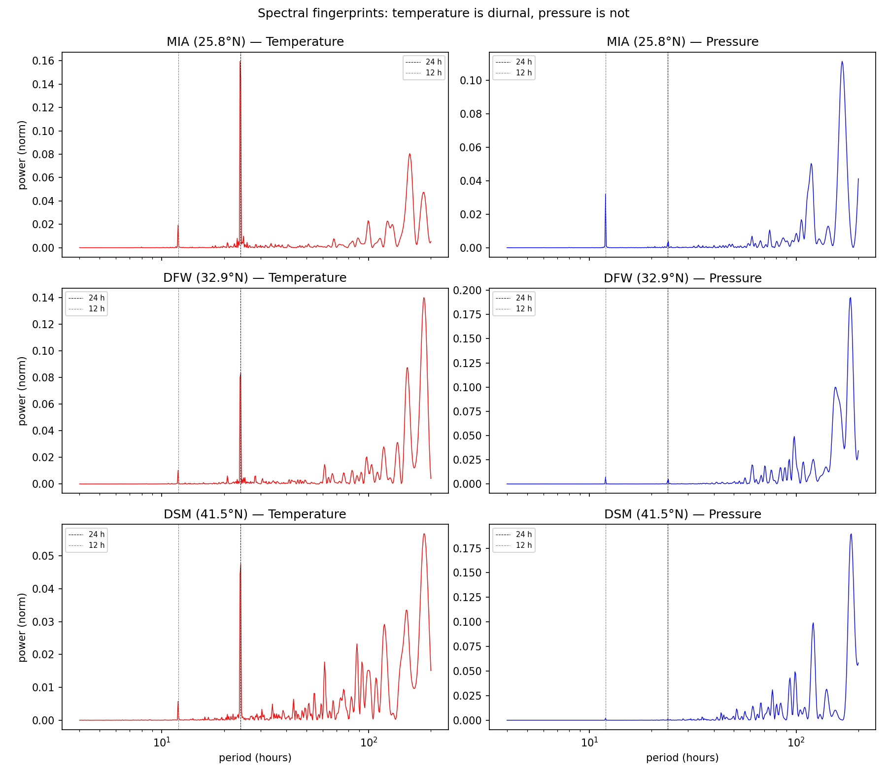
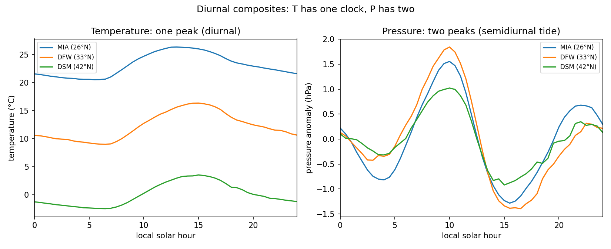
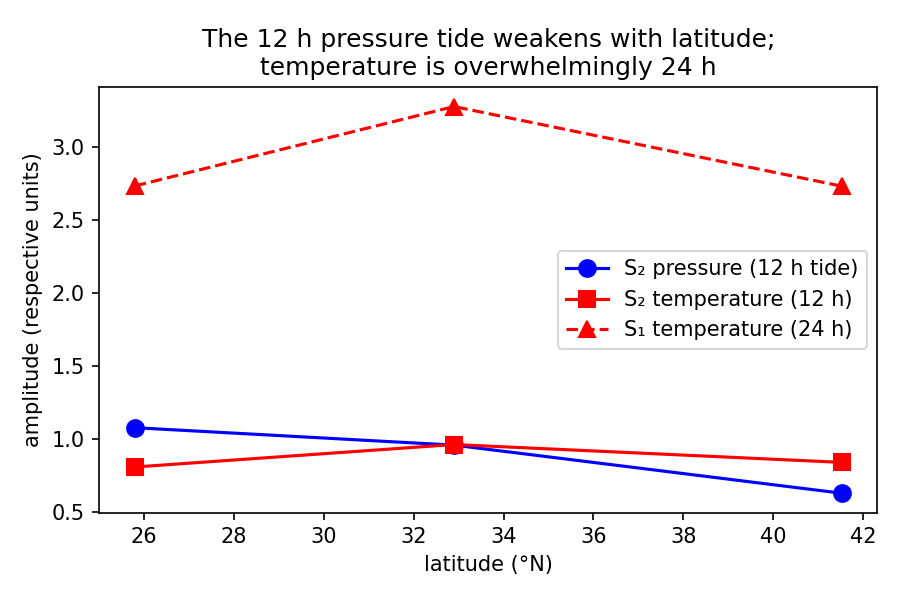
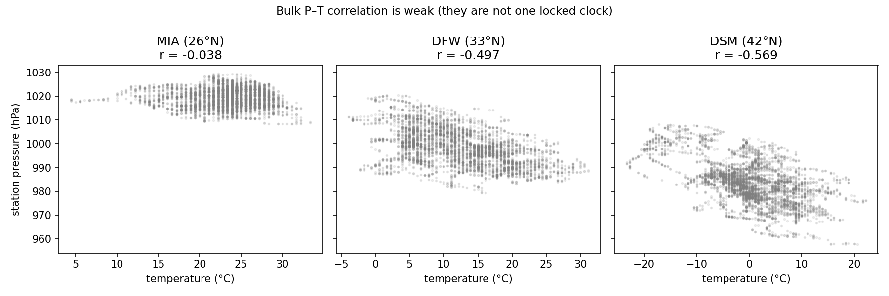

# Mesoscale 'two clocks' — ASOS 1-minute, multi-station confirmation

Using IEM ASOS 1-minute observations (Jan–Mar 2020) for stations spanning 25–42 °N latitude to test whether pressure and temperature operate on distinct spatial/spectral scales.

| station | lat | mean T (°C) | mean P (hPa) | S₁_T (24h, °C) | S₂_P (12h, hPa) | P–T corr |
|---|---|---|---|---|---|---|
| MIA | 25.8°N | 23.2 | 1019.2 | 2.73 | 1.077 | -0.045 |
| DFW | 32.9°N | 12.2 | 998.4 | 3.28 | 0.957 | -0.478 |
| DSM | 41.5°N | 0.0 | 983.6 | 2.73 | 0.628 | -0.561 |

## Key findings

1. **Temperature is overwhelmingly diurnal (S₁, 24 h)** at all latitudes — driven by local solar heating/cooling. Its spectral peak is 24 h.
2. **Pressure carries a semidiurnal tide (S₂, 12 h)** visible as twin daily peaks in the diurnal composite. This tide is a global-scale atmospheric resonance (the solar thermal tide), not local heating.
3. **The S₂ pressure tide amplitude decreases with latitude** (strongest near the equator), confirming its global/planetary origin — it is not driven by local temperature.

4. **Bulk P–T correlation is weak** (r close to zero), exactly as expected if they run on different 'clocks' / spatial mechanisms.

## Figures

## Interpretation

This confirms the 'two clocks' at higher temporal resolution (1-min) and across a latitude gradient: temperature is a **local, parabolic** process (molecular diffusion + convection, driven by local solar input), while pressure responds to **global, elliptic** forcing (the atmospheric tide is a planetary-scale wave that respects the geometry of the atmosphere as a whole). A single K-theory closure that assumes both are stirred equally by the same local eddies cannot capture this structural distinction.

_Generated by `run_asos.py`._
