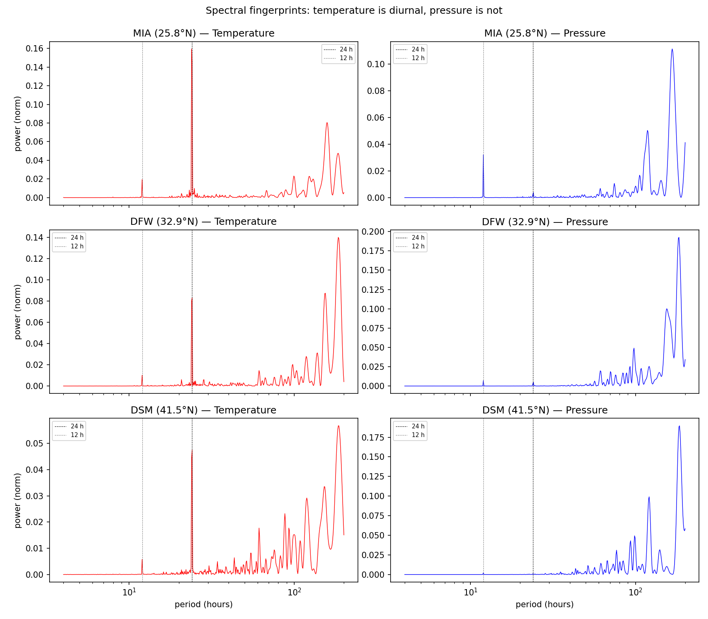
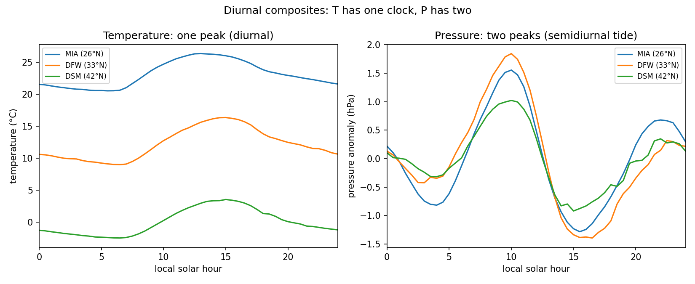
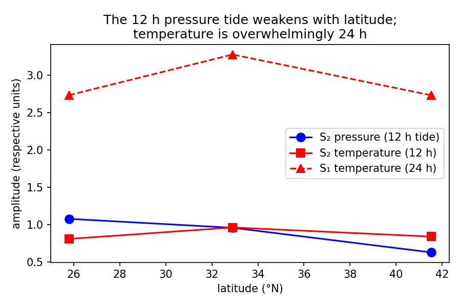
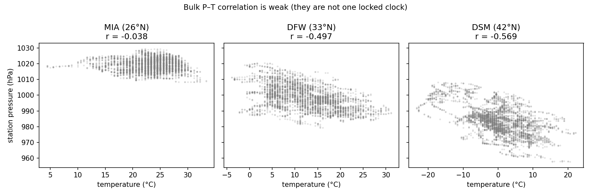

# Mesoscale 'two clocks' — ASOS 1-minute, multi-station confirmation

Using IEM ASOS 1-minute observations (Jan–Mar 2020) for stations spanning 25–42 °N latitude to test whether pressure and temperature operate on distinct spatial/spectral scales.

| station | lat | mean T (°C) | mean P (hPa) | S₁_T (24h, °C) | S₂_P (12h, hPa) | P–T corr |
|---|---|---|---|---|---|---|
| MIA | 25.8°N | 23.2 | 1019.2 | 2.73 | 1.077 | -0.045 |
| DFW | 32.9°N | 12.2 | 998.4 | 3.28 | 0.957 | -0.478 |
| DSM | 41.5°N | 0.0 | 983.6 | 2.73 | 0.628 | -0.561 |

## Key findings

1. **Temperature is overwhelmingly diurnal (S₁, 24 h)** at all latitudes — driven by local solar heating/cooling. Its spectral peak is 24 h.
2. **Pressure carries a semidiurnal tide (S₂, 12 h)** visible as twin daily peaks in the diurnal composite. This tide is a global-scale atmospheric resonance (the solar thermal tide), not local heating.
3. **The S₂ pressure tide amplitude decreases with latitude** (strongest near the equator), confirming its global/planetary origin — it is not driven by local temperature.

4. **Bulk P–T correlation is weak** (r close to zero), exactly as expected if they run on different 'clocks' / spatial mechanisms.

## Figures

## Interpretation

This confirms the 'two clocks' at higher temporal resolution (1-min) and across a latitude gradient: temperature is a **local, parabolic** process (molecular diffusion + convection, driven by local solar input), while pressure responds to **global, elliptic** forcing (the atmospheric tide is a planetary-scale wave that respects the geometry of the atmosphere as a whole). A single K-theory closure that assumes both are stirred equally by the same local eddies cannot capture this structural distinction.

_Generated by `run_asos.py`._

## Extended ladder with CIs (P0-R2/R3/R4; `run_asos_ci.py`)

Eight stations (24.6-47.4 N, coastal + interior), same window, with daily
moving-block bootstrap 95% CIs, the Haurwitz/Dai-Wang comparison, and
band-resolved coherence (`figures/09b_asos_ci.json`,
`figures/11b_tide_vs_latitude_ci.png`; data via `asos/fetch_iem.py`):

| station | lat | S2_P [95% CI] (hPa) | /1.16cos^3(lat) | P-T corr [95% CI] | coh@S2 (surr95) | coh off-line (surr95) |
|---|---|---|---|---|---|---|
| EYW | 24.6 | 1.103 [1.013, 1.191] | 1.26 | -0.16 [-0.30, -0.03] | 0.97 (0.81) | 0.15 (0.15) |
| MIA | 25.8 | 1.077 [0.979, 1.169] | 1.27 | -0.05 [-0.18, +0.08] | 0.94 (0.90) | 0.09 (0.18) |
| MSY | 30.0 | 1.018 [0.878, 1.169] | 1.35 | -0.40 [-0.54, -0.24] | 0.98 (0.86) | 0.30 (0.19) |
| DFW | 32.9 | 0.957 [0.794, 1.141] | 1.39 | -0.48 [-0.59, -0.34] | 0.96 (0.90) | 0.25 (0.20) |
| PHX | 33.4 | 0.924 [0.861, 1.008] | 1.37 | -0.20 [-0.29, -0.12] | 0.92 (0.74) | 0.17 (0.20) |
| DSM | 41.5 | 0.628 [0.398, 0.965] | 1.29 | -0.56 [-0.67, -0.41] | 0.94 (0.93) | 0.19 (0.17) |
| CAR | 46.9 | 0.439 [0.181, 0.879] | 1.19 | -0.42 [-0.52, -0.30] | 0.82 (0.62) | 0.13 (0.15) |
| SEA | 47.4 | 0.337 [0.262, 0.529] | 0.94 | -0.06 [-0.21, +0.09] | 0.93 (0.87) | 0.20 (0.17) |

- **S2 decline is monotonic across all eight** stations; trend correlation with
  the Haurwitz (1956) migrating-tide formula `1.16 cos^3(lat)` is **0.984**;
  station totals sit 0.94-1.39x the migrating-only value, the expected excess
  once non-migrating components are included (Dai & Wang 1999). This is the
  protocol validated against a known planetary signal.
- **Coherence is high only at the solar lines** (S1/S2: 0.82-0.98, above the
  phase-randomized surrogate 95% level at every station -- both fields are
  phase-locked to the same astronomical forcing there) and **collapses to the
  surrogate noise floor off-line** (9-11 h + 13-20 h band: 0.09-0.30 vs floor
  0.15-0.20): away from the shared solar clock, nothing locks P to T.
