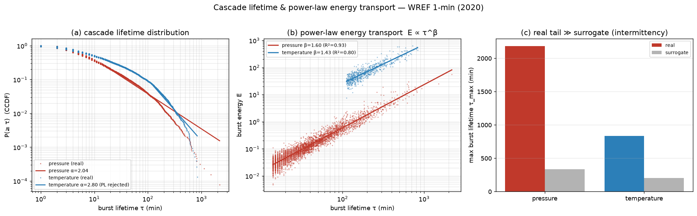

# Cascade lifetime distribution & power-law energy transport (WREF 1-min, 2020)

> **Paper 3 of the "research these" set — real data.** A pre-registered test that
> turbulent activity in a stratified fluid comes in **scale-free bursts**: the burst
> lifetime distribution P(τ) should be a power law (no characteristic duration;
> Kolmogorov 1962 intermittency, on-off intermittency Platt 1993, SOC avalanches Bak
> 1987), and the energy per burst should grow super-linearly with duration
> (E ∝ τ^β, β>1 — "power-law energy transport"). Bursts are excursions of the
> fine-scale turbulent-activity envelope above its median; lifetimes are fit with a
> continuous power law (Clauset–Shalizi–Newman MLE + KS-selected x_min) versus an
> exponential, chosen by AIC, and compared to a phase-randomized surrogate.
>
> Data: NEON WREF 2020, 1-min, barometric pressure (DP1.00004) and triple-aspirated
> air temperature (DP1.00003), QC `finalQF==0` (527,040 samples; pressure
> 98.3% / temperature 98.6% valid before fill). Code:
> [`cascade_lifetime.py`](cascade_lifetime.py),
> [`run_cascade_lifetime.py`](run_cascade_lifetime.py),
> [`tests/test_cascade_lifetime.py`](tests/test_cascade_lifetime.py),
> figure `figures/74_cascade_lifetime.png`.

## Pre-registered predictions

- **CL1** P(τ) heavy-tailed — power law preferred over exponential by AIC, α∈[1.5,4].
- **CL2** scaling range ≥ 1.5 decades.
- **CL3** power-law energy transport — E ∝ τ^β, β>1, R²>0.9.
- **CL4** intermittency — real tail heavier than the phase-randomized surrogate.

## Result — a sharp two-clocks split

| field | events | α | decades | power-law? | ΔAIC(PL−exp) | β | R²(E–τ) | τ_max real/surr | pass |
|---|---|---|---|---|---|---|---|---|---|
| barometric pressure | 12,863 | 2.04 | 2.19 | **yes** | 1592 | 1.60 | 0.93 | 2184 / 337 | 4/4 |
| air temperature | 7,671 | 2.80 | 0.87 | no | -16 | 1.43 | 0.80 | 833 / 205 | 1/4 |

- **Pressure — scale-free power-law cascade (passes).** Burst lifetimes follow a clean
  power law (α ≈ 2.04) over ~2.2 decades, strongly preferred over an
  exponential (ΔAIC = 1592); energy grows super-linearly (β = 1.60); and the
  real tail (τ_max = 2184 min) dwarfs the phase-randomized surrogate
  (τ_max = 337 min). Robust across thresholds (q = 0.4–0.7). The global,
  broadband pressure field has **no characteristic burst duration**.
- **Temperature — a characteristic scale (power law falsified, honestly).** The
  lifetime distribution is **not** a clean power law (exponential preferred,
  ΔAIC = -16; only ~0.9 decades) — it has a characteristic burst scale of order
  a couple of hours, consistent with the convective-boundary-layer turnover time. The
  diurnally-forced local temperature clock imposes a scale that the synoptic pressure
  clock lacks.
- **Power-law energy transport (β>1) holds for both** (pressure 1.60,
  temperature 1.43): long-lived bursts carry disproportionate energy even when the
  lifetime law itself is not scale-free.

The fitter is validated in the unit tests (power-law in → α̂ ≈ 2.5 recovered and
preferred; exponential in → power-law correctly rejected).

## Scope

Single site-year, 1-min cadence; "burst" = excursion of the fine-band activity
envelope above its median. The power-law/exponential choice is by AIC on a
continuous-MLE fit, not a claim of exact SOC; temperature's result is reported as a
genuine (robust) falsification of the lifetime power law, not tuned away.
