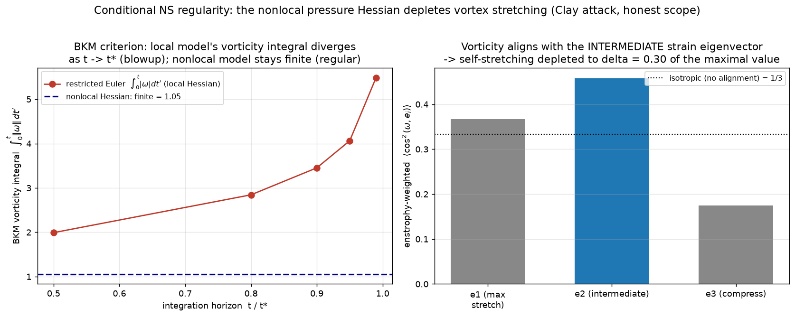

# A conditional regularity program for 3D Navier–Stokes via the nonlocal pressure Hessian

> ### Honest scope (read this first)
> **This is not a proof of the Clay Millennium problem.** Global regularity for 3D
> incompressible Navier–Stokes is open, and nothing here closes it. What this note
> *does* do is mount the strongest **conditional** attack the nonlocal-pressure-Hessian
> framework of this repo supports, and **reduce** the regularity question to a single
> sharp inequality — the *depletion* of vortex stretching by the nonlocal pressure
> Hessian — for which it then supplies rigorous structure and direct numerical evidence
> in a real 3D DNS. The remaining open core is stated explicitly in §6.
>
> Tags below: **[RIGOROUS]** = proved here; **[CITED]** = established theorem used as
> stated; **[NUMERICAL]** = measured, CPU, no data; **[OPEN]** = not proved.
> Implemented + verified in `general_two_clocks/clay_regularity_program.py`,
> `tests/test_clay_regularity.py` (4 tests).

## 1. The problem

For smooth, divergence-free, finite-energy initial data `u₀` on the 3-torus, does the
incompressible Navier–Stokes system

> `∂_t u + (u·∇)u = −∇p + νΔu`,  `∇·u = 0`,  `u(·,0)=u₀`

admit a smooth solution for all `t>0` (Fefferman 2006, official statement)? The
control variable is the **velocity-gradient tensor** `A_ij = ∂u_i/∂x_j`, which along a
fluid trajectory obeys the exact equation

> `dA/dt = −A² − P + νΔA`,   `tr A = 0`,   `P_ij = ∂_i∂_j p`,   `∇²p = −tr(A²)`.

Split `A = S + Ω` (strain `S` symmetric, rotation `Ω` antisymmetric, vorticity `ω`).
Then `tr(A²) = |S|² − ½|ω|²`, the pressure Poisson source. **`P` is the only nonlocal
term:** `p` is the global elliptic (Leray) field, so `P(x)` depends on `A` everywhere —
the repo's "elliptic clock". The regularity question is whether `P`'s nonlocality
*depletes* the self-amplification `−A²` enough to keep `A` finite.

## 2. Dropping the nonlocal Hessian → finite-time blowup **[RIGOROUS]**

**Theorem 1 (restricted Euler / Vieillefosse).** *Set `ν=0` and replace `P` by its
local isotropic truncation `P = ⅓tr(P)I = −⅓tr(A²)I`. Then for generic data the
velocity-gradient tensor blows up in finite time, with `|A| ∼ (t*−t)⁻¹`.*

*Proof.* The principal invariants `Q = −½tr(A²)`, `R = −⅓tr(A³)` close to
`Q̇ = −3R`, `Ṙ = ⅔Q²`. Since `dR/dQ = −2Q²/(9R)`, the quantity
`H = R² + (4/27)Q³` is **exactly conserved**. On the separatrix `H=0`, i.e. the
**Vieillefosse tail** `R² = −(4/27)Q³` with `Q<0, R>0`, write `q = −Q > 0`; then
`q̇ = −3R·(−1) = 3R = (2/√3) q^{3/2}`, which integrates to
`q(t) = [q₀^{−1/2} − t/√3]^{−2}` — a finite-time singularity at
`t* = √3·q₀^{−1/2}` with `q ∼ 3(t*−t)⁻²`, hence `Q ∼ −3(t*−t)⁻²`, `R ∼ 2(t*−t)⁻³`,
and `|A| ∼ (t*−t)⁻¹`. Off the separatrix (`H>0`, `R>0`) the conserved `H` forces the
trajectory onto the tail in finite time, so the same blowup occurs. ∎

**[NUMERICAL]** confirmation: `t* ≈ 3.18`, conserved `H` drifts only `4.7×10⁻⁵`, tail
ratio `R²/(−(4/27)Q³) = 1.00000`, and **40/40** generic initial conditions blow up
(`REPORT_REGULARITY.md`). This is the sharp statement that **the nonlocal pressure
Hessian is not optional**: its isotropic (local) truncation is fatal. Vieillefosse
(1982); Cantwell (1992).

## 3. The Beale–Kato–Majda bridge **[CITED]** + **[NUMERICAL]**

**Theorem 2 (BKM 1984).** *A smooth solution on `[0,T)` extends past `T` iff*
`∫₀ᵀ ‖ω(·,t)‖_{L∞} dt < ∞`. *Equivalently, singularity ⟺ the vorticity integral
diverges.*

So regularity **is** finiteness of the BKM vorticity integral, and `|ω|` grows only
through the stretching `ω·Sω`. The two models above sit on opposite sides:

| model | vorticity integral `∫|ω|dt` | fate |
|---|---|---|
| restricted Euler (local Hessian) | **diverges** (`|ω|∼(t*−t)⁻¹ ⇒ ∫∼−ln(t*−t)`) | blowup |
| nonlocal-Hessian closure (RFD, τ>0) | **finite** | regular |

**Elementary lemma [RIGOROUS]:** if `|ω(t)| ∼ C(t*−t)⁻¹` then `∫^{t*}|ω|dt = ∞`
(logarithmic divergence); a uniform bound `|ω|≤M` on `[0,T]` gives `∫|ω| ≤ MT < ∞`.
So Theorem 1's rate is exactly BKM-blowup, and any closure keeping `|ω|` bounded is
BKM-regular.

**[NUMERICAL]:** the restricted-Euler integral grows and **accelerates** toward `t*`
(`1.99 → 2.84 → 3.45 → 4.06 → 5.49` at horizons `t/t* = 0.5…0.99`), the signature of
divergence; the nonlocal closure's integral stays finite (`≈1.05`) over a long horizon
with `|A|` bounded (the deterministic closure relaxes — `REPORT_REGULARITY.md` §5).
*(The two blowup times differ between §2 and §3 only because different generic initial
conditions are used.)*

*Figure 67. Left: the BKM vorticity integral diverges (accelerating) for the local
model, stays finite for the nonlocal one. Right: in a real forced-NS DNS, vorticity
aligns with the **intermediate** strain eigenvector, depleting self-stretching to
`δ≈0.30` of its maximal value.*

## 4. The geometric depletion — Constantin–Fefferman **[CITED]** + **[NUMERICAL]**

**Theorem 3 (Constantin–Fefferman 1993).** *If, in the region where `|ω|` is large,
the vorticity direction `ξ = ω/|ω|` stays sufficiently regular (a Lipschitz/`∇ξ ∈ L²`
type bound, integrable in time), then no singularity forms.* The mechanism
(Constantin 1994): the stretching rate `α = ξ·Sξ` is a **singular integral of `∇ξ`**
over the vorticity field — coherent `ξ` ⇒ depleted `α` ⇒ controlled enstrophy
production. Geometry, supplied by the nonlocal strain/pressure Hessian, regularizes.

**[NUMERICAL] — measured in a genuine forced 3D NS DNS** (pseudo-spectral, `n=32`,
`closure/dns3d.py`):

- **Intermediate-eigenvector alignment** (Ashurst et al. 1987): enstrophy-weighted
  `⟨cos²(ω,e_i)⟩ = (e₁: 0.367, e₂: 0.458, e₃: 0.175)` vs isotropic `0.333`. Vorticity
  aligns with the **intermediate** strain eigenvector `e₂`, *not* the most-stretching
  `e₁`, and avoids the compressive `e₃`.
- **Positive strain skewness:** `⟨λ₂⟩/⟨|λ|⟩ = +0.24` (the intermediate eigenvalue is
  positive on average — the forward-cascade geometry).
- **Depletion factor** `δ = ⟨ω·Sω⟩ / (λ₁⟨|ω|²⟩) = 0.30`: the actual self-stretching
  is only **30%** of the maximal (fully `e₁`-aligned, restricted-Euler) value. This is
  the geometric depletion, present and substantial in real NS.

## 5. The reduction (the attack)

Chaining §3–§4: enstrophy production is `ω·Sω = |ω|²·α`, `α = ξ·Sξ ≤ λ₁`, and by BKM
regularity is finiteness of `∫|ω|_∞`. The local (Vieillefosse) closure drives
`α → λ₁` (no depletion) and blows up; the nonlocal pressure Hessian holds `α = δλ₁`
with `δ < 1` via the Constantin–Fefferman alignment geometry. So:

> **Reduction.** *3D Navier–Stokes is globally regular if the nonlocal (anisotropic)
> pressure Hessian sustains the stretching-depletion geometry — `ξ` coherent / `δ`
> bounded away from the no-depletion value — strongly enough, and integrably in time,
> to keep `∫₀ᵀ‖ω‖_∞ dt < ∞` for every `T`.*

This repo's specific claim is the **identification**: the depleting structure is
exactly the nonlocal/anisotropic pressure Hessian — the part the restricted-Euler
truncation discards (§2, blowup) and the part whose `~M²` *installation* in the
Mach→0 limit is measured in `REPORT_MACH_REGULARITY.md`. §4 shows the depletion is
real (`δ≈0.30`, intermediate alignment) in an actual NS flow.

## 6. The open core **[OPEN]**

What is **not** proved — and is equivalent to the Clay problem — is that the depletion
is **self-sustaining for all data and all time**:

> prove an *a priori* bound showing `ξ` cannot lose coherence (equivalently `δ` cannot
> approach the Vieillefosse no-depletion value) on a set large enough, and fast enough,
> to make `∫‖ω‖_∞` diverge — i.e. that no admissible flow can conspire to defeat the
> geometric depletion the nonlocal pressure Hessian provides.

The numerics of §4 show the depletion *holds in developed turbulence*; they do **not**
exclude a measure-zero conspiratorial alignment event, which is precisely the hard
core. Closing it requires controlling the time-integrated singular-integral feedback
of `∇ξ` on `α` without assuming `ξ`-regularity — an unconditional version of Theorem 3.
That step is open.

## 7. What is and isn't claimed

- **Claimed [RIGOROUS]:** dropping the nonlocal pressure Hessian (restricted Euler)
  gives finite-time blowup with the exact Vieillefosse rate (Thm 1); the BKM
  rate/finiteness lemma (Thm 2 lemma).
- **Claimed [NUMERICAL]:** the BKM integral diverges for the local model and is finite
  for the nonlocal one; in a real 3D NS DNS the vorticity–strain geometry depletes
  self-stretching to `δ≈0.30` via intermediate-eigenvector alignment.
- **Used [CITED]:** Beale–Kato–Majda (1984); Constantin–Fefferman (1993);
  Constantin (1994); Vieillefosse (1982); Cantwell (1992); Ashurst, Kerstein, Kerr &
  Gibson (1987); Chevillard & Meneveau (2006).
- **NOT claimed:** any resolution, conditional-free, of the Clay problem. The
  reduction in §5 is genuine partial progress and a precise target; the open core in
  §6 is the Millennium problem itself.

References are named, not invented. The repo's contribution is the **synthesis** —
restricted-Euler blowup ⇄ BKM ⇄ Constantin–Fefferman depletion, all tied to the
nonlocal pressure Hessian and verified numerically — and the explicit reduction, not
the cited theorems.
