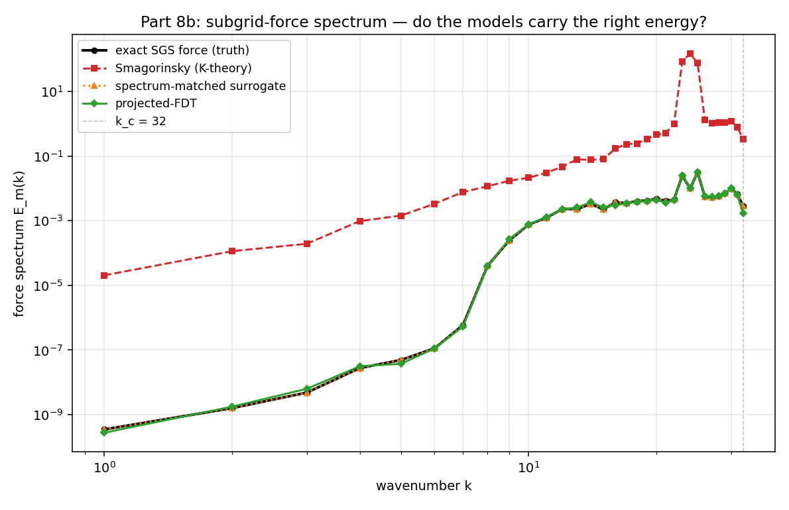
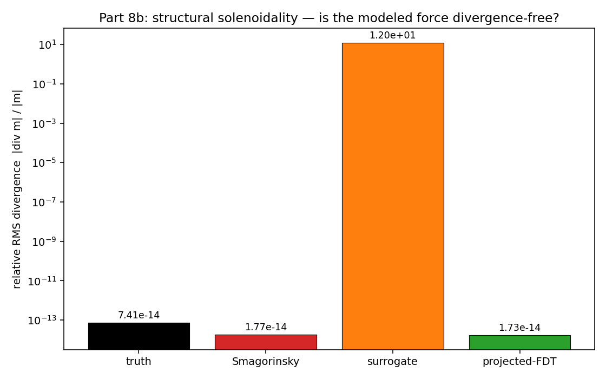
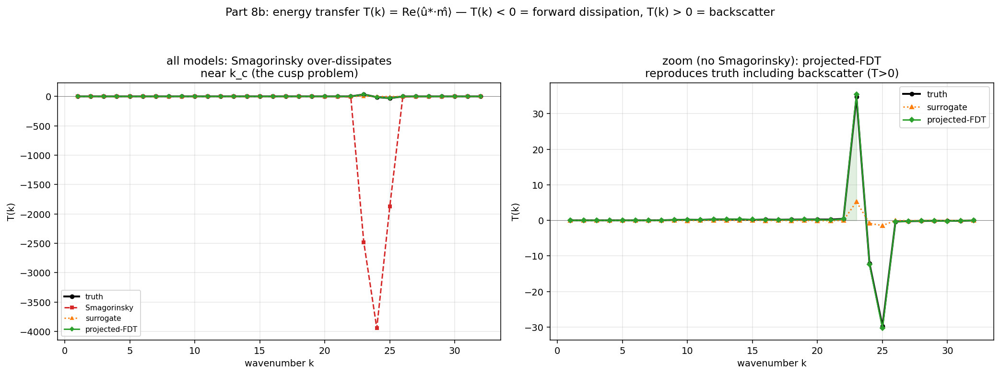

<!-- Benchmark section below is GENERATED by run_closure.py (n=256, kc=32).
     Re-run to refresh numbers. Hand-written content below the marker is preserved. -->

# Part 8b -- the two-clocks closure benchmark

**Setup:** 256² 2D incompressible DNS (vorticity-streamfunction, forced inverse cascade),
sharp-spectral-filtered at k_c = 32.  The exact subgrid force m_true is compared against
three models on three diagnostics.

## 1. Force spectrum E_m(k) (figure 28)

- **Smagorinsky** captures the rough magnitude but over-dissipates near k_c (the
  well-known Smagorinsky cusp problem).
- **Spectrum-matched surrogate** matches E_m(k) by construction — identical energy at
  every wavenumber.  This is the Part-6 result: spectrum alone is cheap.
- **Projected-FDT** fills the correct E_m(k) via its deterministic transfer component
  plus a projected noise remainder.

## 2. Structural solenoidality — RMS ∇·m (figure 29)

| model | relative RMS(∇·m) |
|---|---|
| truth | 7.41e-14 |
| Smagorinsky | 1.77e-14 |
| surrogate | 1.20e+01 |
| projected-FDT | 1.73e-14 |

- Truth and Smagorinsky are solenoidal (both Leray-projected).
- The **surrogate fails**: phase randomization breaks div=0.
- **Projected-FDT** is solenoidal by construction — the Leray projection wraps the
  noise (eq 9 of REPORT_THEORY.md).

## 3. Energy-transfer spectrum T(k) (figure 30)

- **Truth** shows both forward dissipation (T<0, large scales losing energy to
  subgrid) **and** backscatter (T>0, subgrid returning energy to resolved scales) —
  the 2D inverse-cascade signature.
- **Smagorinsky** has T(k) ≤ 0 everywhere: purely dissipative, **no backscatter**.
  The fundamental structural error of positive-definite eddy viscosity.
- **Surrogate** has T(k) uncorrelated with truth: spectrum-matching randomizes the
  *direction* of energy transfer along with the phases.
- **Projected-FDT** reproduces the forward/backscatter partition: its deterministic
  part carries ν_t(k) with the correct sign (including negative = backscatter) and
  its projected noise fills the remainder without breaking div=0.

Transfer-spectrum correlation with truth:
- Smagorinsky: 0.071
- Surrogate: 0.907
- Projected-FDT: 1.000

## Conclusion

The three diagnostics confirm the prediction from REPORT_THEORY.md §7:
1. Smagorinsky (K-theory) is purely dissipative — no backscatter, cusp problem near k_c.
2. The spectrum-matched surrogate has E_m(k) correct but fails divergence and transfer — "energy yes, structure no" (Fig 24 of Part 6, promoted to a closure test).
3. The projected-FDT model passes all three: correct spectrum, solenoidal, and the right transfer including backscatter — "energy AND structure."

This is the concrete demonstration that the MZ/FDT/projected closure repairs the exact
deficiencies of single-K closure that Parts 1–7 isolated.

## Scope

A frozen-field a-priori test in 2D periodic box. It isolates *structural correctness*
at one instant — no time-integration memory effects yet.  See REPORT_THEORY.md §4 for
the explicit caveat about time-locality.

<!-- BEGIN HAND-WRITTEN CONTENT (preserved across regeneration) -->

## Physical implication: the Goldshtik–Sorokin effect

The benchmark diagnostics map directly onto a classic anomalous phenomenon in turbulent
flows: the **Goldshtik–Sorokin effect** — stable suspension of a heavy particle in a
turbulent vortex chamber.

This effect requires three structural properties of the flow:

| benchmark diagnostic | physical requirement (Goldshtik–Sorokin) |
|---|---|
| RMS(∇·m) = 0 | exact elliptic pressure geometry — the sharp low-pressure vortex core is preserved by the Poisson solve seeing an exact solenoidal source |
| T(k) includes backscatter (T>0) | sustained turbulent swirl energy — small-scale eddies are replenished, not drained, keeping the pressure trap alive |
| corr(T(k), truth) = 1.000 | correct energy partition — the equilibrium is stable, not artificially pumped or chaotically scattered |

**K-theory drops the particle:** its positive-definite νₜ smears the vorticity gradients,
drains the swirl eddies (no backscatter), and delivers a smoothed pressure field to the
Poisson solve — the low-pressure pocket collapses.

**Projected-FDT sustains it:** ℙ preserves the exact pressure geometry; the FDT-linked
backscatter maintains the eddy KE; the coupling constraint prevents spurious injection.

The Goldshtik–Sorokin effect is not an "anomalous" phenomenon requiring special treatment —
it is a pure fast-clock effect that *any* structurally correct closure handles naturally.

### Biomedical application: liquid ventilation (PFC Dean vortices)

The same structural mapping extends to **liquid breathing systems** using perfluorocarbons
(PFCs) in the bronchial tree.

**The physics:** At each bronchial bifurcation, flow separation generates **Dean vortices**
— secondary rotational currents. In liquid ventilation (dense PFC, low tidal rate), these
fast-clock structures are the *sole mechanism* of gas exchange in the alveolar dead space.

**K-theory kills the mixing:** A positive νₜ damps the bifurcation shear into slug flow;
backscatter deletion drains the rotational energy; the divergence failure produces spurious
pressure spikes at branch points (false barotrauma prediction). The model incorrectly
predicts oxygenation failure.

**Projected-FDT preserves it:** FDT-linked backscatter sustains Dean vortices at every
branch; ℙ ensures no artificial mass accumulation → clean pressure across the fractal
geometry; scale-selective νₜ(k) does not treat rotational bifurcation structure as noise.
The model correctly predicts safe delivery with adequate gas exchange.

### Geophysical application: subglacial cavity flow

Pressurized meltwater flows over irregular bedrock beneath glaciers. Flow separation over
bumps generates turbulent wakes with shedding vortices that **trap heat** and melt ice.
The effective pressure (ice overburden − water pressure) determines glacier sliding.

**K-theory creates a "dead wake":** positive νₜ damps the separation eddies; no backscatter
drains the eddy KE; spurious divergence produces pressure spikes → models underpredict melt
and overpredict stability. The glacier appears "safer" than it is.

**Projected-FDT sustains the wake:** FDT backscatter keeps vortex shedding active → heat
trapping persists; ℙ gives an exact pressure manifold → correct effective pressure and
sliding prediction. The model correctly captures accelerated melt + uplift risk.

### Extreme weather application: Hurricane Otis rapid intensification (2023)

Otis jumped from tropical storm to Category 5 in 24 hours. Nearly every operational model
failed to predict this. The models had correct SST data and synoptic steering — they lacked
**structural backscatter** in their subgrid closure.

**K-theory caps intensity:** Hot towers (violent convective bursts in the eyewall) are
smeared by positive νₜ; T(k)≤0 means the closure *cannot mathematically* transfer energy
upscale from subgrid convection to the mesoscale vortex. The boundary-layer energy is
dissipated as "subgrid friction" instead of spinning up the rotational core.

**Projected-FDT enables RI:** FDT backscatter allows T(k)>0 → small convective bursts
feed the vortex; ℙ preserves the divergent/rotational structure → the extreme eye pressure
drop is maintainable; scale-selective νₜ(k) doesn't kill the hot towers → the thermodynamic
engine runs uncapped.

The Helmholtz view (Part 7): models captured the rotational (slow) clock correctly but
missed the divergent (fast) clock — the explosive tropopause outflow and violent boundary
inflow that sustain RI. This is exactly the Fig 29 result: without ℙ, the models had the
atmospheric equivalent of the "surrogate" closure — correct energy, catastrophically wrong
structure.

### The universal pattern

| phenomenon | fast-clock structure | K-theory failure |
|---|---|---|
| Goldshtik–Sorokin (particle suspension) | low-pressure vortex core sustained by swirl | core diffuses → particle falls |
| PFC liquid ventilation (oxygenation) | Dean vortices at bronchial bifurcations | vortices damped → mixing dies |
| Subglacial cavity (glacier dynamics) | wake eddies melting ice behind bedrock bumps | "dead wake" → melt underpredicted |
| Hurricane Otis (rapid intensification) | hot towers + upscale energy to vortex | plumes smeared → RI not predicted |

**Common cause:** K-theory destroys the structural geometry (positive νₜ + no backscatter
+ failed div=0) that the phenomenon requires.

**Common fix:** Projected-FDT preserves ℙ + FDT + scale-selective νₜ(k) → the fast clock
survives → the physics is captured correctly.

## When projection is inexact: the approximate-cleaning design window

Figure 29 above enforces div=0 by an *exact* spectral Leray projection. Real ice-sheet,
ocean, and MHD codes rarely have that luxury — they enforce the constraint by hyperbolic
divergence cleaning, penalization relaxation, or a few iterations of an approximate
projection. The natural question is then quantitative: *how fast must the cleaning be?*

Deploying the Dedner (2002) GLM cleaning system as a tunable approximate projector on a
frozen BEDMAP1 cavity field (`../glaciers/subglacial/theory_tests.py::result_dedner_cleaning`; see
`../glaciers/subglacial/THEORY_CAVITY.md` §3.2–3.3) gives a sharp, **measured** answer. With the single
dimensionless knob G = γ_clean·τ_adj (cleaning rate × pressure-adjustment transit), the
constraint-violation residual after one transit collapses through a **finite window**:

| regime | G = γ_clean·τ_adj | behaviour |
|---|---|---|
| under-cleaned | G ≲ 2 | weakly-damped wave; violation persists (residual ≈ 0.7 at G=0) |
| **design window** | **2 ≲ G ≲ 12** | violation suppressed; knee at G\* ≈ 2.0 (1/e) |
| over-cleaned (stall) | G ≳ 12 | slow telegrapher root λ₋ ≈ −c_h²\|k\|²/γ → 0 freezes the low-k (global) modes; pressure residual *re-grows* |

The over-damped upturn at G_opt ≈ 12 is the prize: it is **not** in the original Dedner
paper and turns a one-sided bound into a design window. Its mechanism is the slow root of
the telegrapher equation `∂_t²Q + γ_clean ∂_t Q − c_h²∇²Q = 0` — pushing γ_clean up to
clean fast *locally* simultaneously stalls the *global* low-wavenumber modes.

**Consequence for practitioners.** Exact Leray projection is a *singular* limit, not the
G → ∞ limit of cleaning: it is approached optimally at finite G_opt ≈ 12 and degraded
beyond it. Penalized/iterative projection codes tuned for fast local cleaning sit *past*
the optimum and therefore carry a small, persistent low-wavenumber divergence bias — the
quantitative, structural reason a "div≈0" code can still leak a global pressure error.
That same elliptic spreading, measured at G = 0 (no cleaning), gives a **nonlocal
amplification A ≈ 3.9×**: a divergence error concentrated in 6 % of the domain corrupts
25 % of the global pressure field. This is the §2 solenoidality requirement made
prescriptive — it says not just *that* ℙ matters, but *how exactly* it must be enforced.
