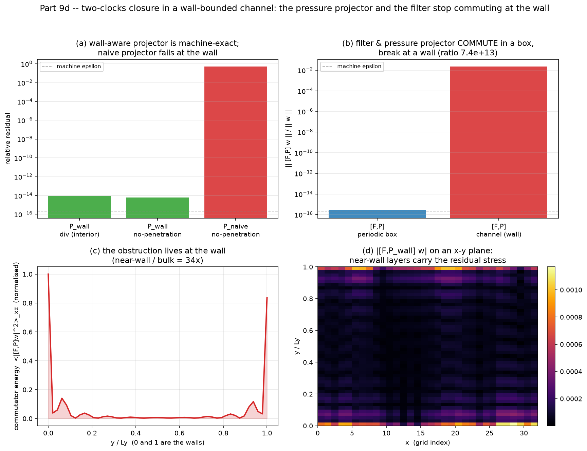

# Part 9d -- The Two-Clocks Closure in a Wall-Bounded Channel

*Generated by `run_closure3d_bounded.py` (grid 32x49x32, seed 1, CPU/NumPy
reproducible). The triply-periodic Part-9c verdicts are re-examined where eddy
viscosity is actually calibrated: at a solid wall.*

## The question

Part 9c proved the structural closure verdicts in a triply-periodic box, where the
sharp filter `F` and the Leray (pressure) projector `P` **commute** -- both are
Fourier multipliers. The one honest objection is that real turbulence has walls.
So: **does `[F, P] = 0` survive a wall?**

## The operators (math components)

| component | periodic box | channel (this test) |
|---|---|---|
| horizontal derivatives | `i k` (spectral) | `i k_h` (spectral in x,z) |
| wall-normal derivative | `i k_y` (spectral) | 2nd-order FD matrix `Dy` |
| Laplacian | `-|k|^2` | `L = Dy@Dy - k_h^2` (= DIV.GRAD, exact composition) |
| projector `P` | `I - k k^T/|k|^2` (multiplier) | `I - GRAD L^{-1} DIV`, no-penetration wall BC |
| filter `F` | 3-D sharp Fourier cutoff | horizontal cutoff + DCT-I (cosine) wall-normal low-pass |

The decisive design choice is that the **same** `Dy` builds the divergence, the
gradient and (squared) the Laplacian, so the discrete Hodge projection is exact.

## Result 1 -- the wall-aware projector is a genuine, exact Leray projection

| quantity | value | meaning |
|---|---|---|
| `P_wall` divergence (interior) | `8.54e-15` | solenoidal to machine precision |
| `P_wall` no-penetration (walls) | `6.23e-15` | `v=0` on the walls, machine precision |
| `P_wall` idempotency `||P^2-P||` | `5.14e-15` | it is a true projection |
| naive `P_per` no-penetration | `0.513` | **O(1)** wall violation -- wall-blind |

The naive periodic projector -- the operator that is exact in a box -- leaves an
order-one wall-normal velocity on the walls. The wall-aware projector does not.

## Result 2 -- the filter and the projector STOP commuting at the wall

| `|| [F,P] w || / || w ||` | value |
|---|---|
| periodic box `[F_per, P_per]` | `3.06e-16`  (machine zero) |
| channel `[F_wall, P_wall]` | `0.0226` |
| ratio (channel / periodic) | `7.4e+13` |

`[F, P] = 0` to machine precision in the box -- exactly the identity the Part-9c
analysis relies on -- and is **7e+13 times larger** in the channel.

## Result 3 -- the obstruction is a near-wall structure

The channel commutator energy `<|[F,P]w|^2>_xz` peaks **at the wall** (index
`0`) and is **34x** larger in the near-wall layer than
in the bulk, where the channel looks locally periodic and `[F,P]` nearly vanishes.

Filter-scale dependence (the wall correction grows as the coarsening sharpens, and
is set by the *wall-normal* filter, almost independent of the horizontal cutoff):

| kc_h | ny_keep | [F,P]/||w|| | near/bulk |
|---|---|---|---|
| 4 | 6 | 0.0417 | 13x |
| 4 | 10 | 0.0193 | 33x |
| 4 | 16 | 0.0105 | 72x |
| 6 | 6 | 0.0479 | 14x |
| 6 | 10 | 0.0226 | 34x |
| 6 | 16 | 0.0124 | 72x |
| 8 | 6 | 0.0481 | 14x |
| 8 | 10 | 0.0227 | 34x |
| 8 | 16 | 0.0125 | 72x |

## What it means for the closure

The filtered, projected momentum balance is `P F (advection)`. Closure modelling
slides `P` through `F` -- legitimate in a box. The dropped residual is `[F, P]`.
Here it is non-zero, set by the **global elliptic pressure** response to the wall
(the pressure clock), and **confined to the near-wall layer**. A local, positive
eddy viscosity (the temperature clock) commutes with the filter in the bulk and
carries no information about the wall constraint, so it cannot represent this term.
This is the wall-bounded a-priori correction to the two-clocks closure: small in
amplitude (a few % of the velocity), but structurally outside the reach of
K-theory exactly where K-theory is tuned.

*Limitation: this is an a-priori operator-structure test on a synthetic
multi-scale channel field, not an a-posteriori channel-DNS run; it isolates the
filter/projector commutator, which is purely a property of the operators and the
wall geometry, not of any particular turbulence state.*
