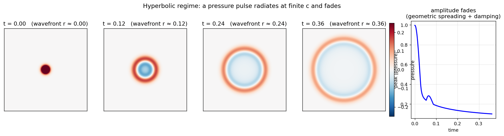
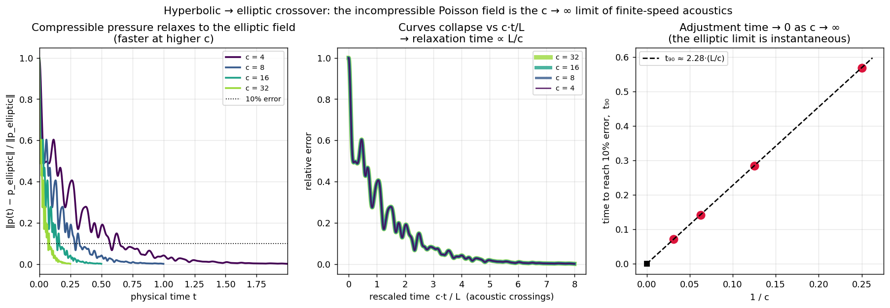
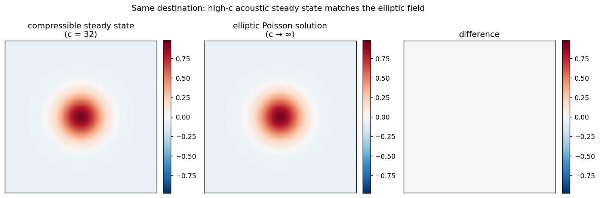

# Hyperbolic → elliptic crossover (compressible acoustics)

A minimal 2D linear-acoustics solver on a periodic grid, used to show how the pressure field changes PDE type with compressibility.

## Setup

Linear acoustics about a fluid at rest:

```
dp/dt = -rho0 c^2 (div u)
du/dt = -(1/rho0) grad p + f - gamma u
```

- Finite sound speed `c` ⇒ pressure obeys a **wave equation** (hyperbolic): signals travel at speed c.
- As `c → ∞` the system becomes stiff and the steady-state pressure satisfies the **elliptic** Poisson equation `∇²p = rho0 ∇·f` — the incompressible / low-Mach limit.

## Experiment 1 — radiating pulse

An initial localized pressure bump propagates outward as a ring at speed c and its peak amplitude fades (geometric spreading in 2D + light damping). This is the finite-speed, wave-like behaviour your acoustic intuition describes: a local energy anomaly the fluid tries to relax, radiating away rather than resolving instantly.

## Experiment 2 — the crossover

Under a fixed irrotational forcing `f = ∇ψ`, the compressible pressure relaxes to the **same** field the elliptic Poisson solve gives, but the time to get there scales as `L/c`:

| sound speed c | time to 10% error t₉₀ | final relative error |
|---|---|---|
| 4 | 0.570 | 2.02e-03 |
| 8 | 0.285 | 2.02e-03 |
| 16 | 0.142 | 2.02e-03 |
| 32 | 0.071 | 2.02e-03 |

A line through the origin fits `t₉₀ ≈ 2.28·(L/c)`: the adjustment time is inversely proportional to the sound speed and → 0 as `c → ∞`. Plotting the error against the rescaled time `c·t/L` collapses all the curves, confirming that c's only role is to set the clock speed of the global pressure adjustment.

## Interpretation

- **Hyperbolic (finite c):** real, compressible fluids carry pressure information as sound waves at finite speed. A local divergence anomaly radiates outward and is resolved over an acoustic crossing time `~L/c`. In water `c ≈ 1500 m/s` (vs ~340 m/s in air), so this limit is approached even harder — hydraulic pressure is felt across large distances almost instantly.
- **Elliptic (c → ∞):** in the incompressible limit the same pressure field is established *instantaneously and globally* by the Poisson solve. This is the regime of the Rayleigh-Bénard DNS in `REPORT_RB.md`, where pressure is smooth/global (a low-pass filter) and buoyancy is sharp/local.

The two are the same physics at different compressibility: the elliptic Poisson constraint is the low-Mach limit of finite-speed acoustics.

## Scope

This **demonstrates** the crossover. It does **not** test 3D Navier-Stokes regularity / the Beale-Kato-Majda criterion, nor the wave-radiation-damping argument — those require rigorous PDE analysis (and, for a real flow, a full nonlinear compressible simulation), not a linear-acoustics demo.

## Figures




