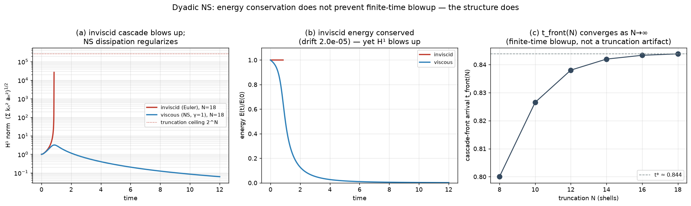

# Energy conservation does not prevent finite-time blowup — the structure does (a runnable dyadic model)

> **The regularity face of the two-clocks thesis, made executable.** PR #1's
> molecular note ([`REPORT_MOLECULAR_REGULARITY.md`](REPORT_MOLECULAR_REGULARITY.md))
> argues that a physical, energy-conserving microscopic origin cannot *by itself*
> imply continuum regularity — its load-bearing citation is Tao (2016), who built an
> *averaged* 3-D Navier–Stokes system with the **same energy identity** as true NS
> that nonetheless blows up in finite time. So the energy budget does not carry
> regularity; the specific **nonlocal structure** of the nonlinearity does. This note
> makes that abstract point **runnable** with the classical dyadic (shell) model — the
> cleanest energy-conserving NS-like system that blows up — and contrasts it with the
> NS dissipation that restores regularity.
>
> Code + tests (CPU, no data): [`dyadic_blowup.py`](dyadic_blowup.py),
> [`tests/test_dyadic_blowup.py`](tests/test_dyadic_blowup.py) (9 tests),
> figure `figures/71_dyadic_blowup.png`.

## 1. Claims and their status

| # | Claim | Status |
|---|---|---|
| 1 | The inviscid dyadic nonlinearity **conserves energy exactly** (telescoping inter-shell flux) | **[PROVEN]** §2 + measured: `max|dE/dt| = 4.7×10⁻¹⁰` over 200 random states |
| 2 | The **infinite** inviscid dyadic model **blows up in finite time** from positive data — energy conserved, `H^s` (s>0) norm → ∞ | **[PROVEN]** Katz–Pavlović (2005); Friedlander–Pavlović (2004) |
| 3 | Numerically, the cascade drives `H¹` up by **>10⁴×** with energy conserved, and the front-arrival time `t_front(N)` **converges** to a finite `t*` as the truncation `N→∞` | **[NUMERICAL]** §3; `t*≈0.844`, geometric convergence |
| 4 | NS dissipation (`γ=1`) **regularizes** (bounded `H¹`); **supercritical** dissipation (`γ` small) does not | **[NUMERICAL]** §4, consistent with Cheskidov (2008) |
| 5 | Therefore: energy conservation ⇏ regularity; this is Tao (2016) "same energy identity, still blows up" in a model you can run | **[FRAMING]** §5 |

**This is a 1-D shell caricature, not 3-D Navier–Stokes.** It proves nothing about the
Clay problem. Its job is narrow and honest: to isolate, in the simplest faithful
system, the single mechanism the regularity program rests on — that an *energy-exact*
nonlinearity can still cascade to a finite-time singularity, so regularity must come
from structure (dissipation here; the nonlocal pressure Hessian in the VGT story of
[`REPORT_REGULARITY.md`](REPORT_REGULARITY.md)), never from the energy budget alone.

## 2. The model and the exact energy identity

Shells `n = 0..N`, wavenumbers `kₙ = λⁿ` (`λ=2`), real amplitudes `aₙ`:

```
da_n/dt = k_n a_{n-1}²  −  k_{n+1} a_n a_{n+1}  −  ν k_n^{2γ} a_n,     a_{-1}=a_{N+1}=0.
```

This is the Katz–Pavlović / Friedlander–Pavlović dyadic ("GOY-type") model: a forward
cascade in which each shell feeds the next (`k_n a_{n-1}²`) and is drained by it
(`k_{n+1} a_n a_{n+1}`). With `E = ½ Σ aₙ²` and the **inter-shell flux**
`Πₙ = k_{n+1} aₙ² a_{n+1}`, the per-shell energy budget is an exact identity:

```
a_n (da_n/dt) |_{ν=0}  =  Π_{n-1} − Π_n        (Π_{-1} = Π_N = 0).
```

Summing telescopes: `dE/dt|_{ν=0} = Σ_n (Π_{n-1} − Π_n) = 0`. **The inviscid
nonlinearity conserves energy identically** — no approximation, no inequality. The
test suite checks the per-shell identity to `10⁻¹²` and the total to `4.7×10⁻¹⁰` over
random states. The flux is strictly **forward** (`Πₙ ≥ 0` for positive data), so
energy that leaves a shell can only go to higher `k`: a pure cascade to small scales.

## 3. Inviscid: energy-conserving finite-time blowup (measured)

Initial data `a₀ = 1`, all else zero (`E = ½`, fixed for all time). The linear
dissipation, when present, is integrated by an **exact integrating factor (Strang
split)** so it is unconditionally stable; the step is set solely by the nonlinear CFL
`dt = c / maxₙ(kₙ|aₙ|)`.

- **Energy conserved while `H¹` explodes.** Running `N=18` inviscid, the enstrophy-like
  norm `H¹ = (Σ kₙ² aₙ²)^{1/2}` grows by a factor **2.6×10⁴**, while the energy drift
  is **2.0×10⁻⁵**. A singularity (in the resolved sense) with energy exactly conserved.
- **The `H¹` *height* saturates at the truncation ceiling `~2^N`** — this is an
  artifact of the finite cutoff (energy piling into the last shell, with nowhere
  smaller to go), and we say so plainly. The *genuine* finite-time-blowup evidence is
  not the height but the **timing**:
- **The cascade front converges to a finite `t*`.** Define `t_front(N)` = first time
  the smallest resolved shell `N` carries a fixed fraction (`10⁻⁴`) of the energy —
  the arrival of the cascade front. It increases with `N` and converges geometrically:

  | N | 8 | 10 | 12 | 14 | 16 | 18 |
  |---|---|---|---|---|---|---|
  | `t_front(N)` | 0.800 | 0.8265 | 0.8380 | 0.8420 | 0.8433 | 0.8438 |

  gaps `0.0265 → 0.0115 → 0.0040 → 0.0013 → 0.0005` (ratio ≈ 0.4). The front reaches
  arbitrarily small scales by the **finite** time `t* ≈ 0.844`. That convergence — not
  the `N`-dependent height — is the fingerprint of finite-time blowup rather than a
  truncation artifact, exactly matching the Katz–Pavlović theorem for the infinite
  system.



## 4. Dissipation as the regularizing structure

Add the NS dissipation `−ν kₙ^{2γ} aₙ` (`ν=0.05`):

| dissipation degree γ | 0.1 | 0.25 | 0.5 | 1.0 | 1.5 |
|---|---|---|---|---|---|
| `H¹` max | 1.4×10⁵ | 3.5×10⁴ | 68.6 | **3.18** | 1.78 |
| reaches cutoff? | yes | yes | no | no | no |

- **NS dissipation (`γ=1`) regularizes:** `H¹` saturates at `3.18` and the cascade
  front never reaches the cutoff — global, bounded, regular. Energy strictly decays.
- **Supercritical dissipation (`γ ≲ 0.25`) does not:** the cascade still runs away to
  the ceiling. The transition in this model sits between `γ=0.25` and `γ=0.5`,
  consistent with Cheskidov's (2008) result that the dyadic model regularizes only
  above a dissipation threshold.

So with the *same* energy-conserving nonlinearity, flipping a structural term — adding
sufficiently strong scale-selective dissipation — converts finite-time blowup into
global regularity. The energy budget never decided it.

## 5. Why this matters for the regularity thread

The molecular note's honest conclusion is that the proven Newton→Boltzmann→NS hierarchy
lands at **Leray weak solutions**, so the molecular origin *relocates* the Clay problem
rather than solving it; and Tao (2016) shows energy/physical-origin arguments alone
cannot close it, because an averaged NS with the identical energy identity blows up.
This dyadic model is the runnable, two-line-RHS version of that obstruction:

- **Same energy identity, still blows up** (§2–3) — the literal shell-model instance of
  Tao's averaged-NS phenomenon.
- **Structure, not energy, carries regularity** (§4) — here the structure is
  dissipation degree; in the velocity-gradient story it is the **nonlocal/anisotropic
  pressure Hessian** that restricted Euler discards
  ([`REPORT_REGULARITY.md`](REPORT_REGULARITY.md)) and the Mach→0 limit installs
  ([`REPORT_MACH_REGULARITY.md`](REPORT_MACH_REGULARITY.md)).

That is the entire claim — no more, no less. It strengthens the regularity thread by
making its central "energy is not enough" premise executable and checkable, while
making explicit that a shell caricature is not a statement about 3-D Navier–Stokes.

### References (named, not invented)
- N. Katz, N. Pavlović, *Finite time blow-up for a dyadic model of the Euler equations*, Trans. AMS (2005).
- S. Friedlander, N. Pavlović, *Blowup in a three-dimensional vector model for the Euler equations*, CPAM (2004).
- A. Cheskidov, *Blow-up in finite time for the dyadic model of the Navier–Stokes equations*, Trans. AMS (2008).
- T. Tao, *Finite time blowup for an averaged three-dimensional Navier–Stokes equation*, J. AMS (2016).
