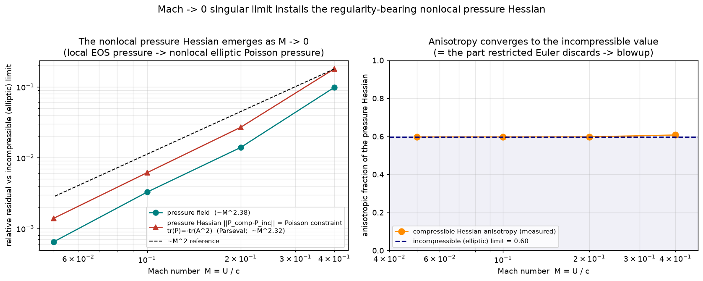

# The Mach → 0 singular limit installs the nonlocal pressure Hessian

> **The bridge between the two faces of the thesis.** `REPORT_NS.md` shows a
> nonlinear compressible flow approaching the incompressible (elliptic) pressure as
> the Mach number `M = U/c → 0`. `REPORT_REGULARITY.md` shows that the *nonlocal,
> anisotropic* part of the pressure **Hessian** is the structure that carries
> regularity for the velocity-gradient tensor (discard it → restricted Euler →
> finite-time blowup). This note connects them: it measures, in the running
> compressible DNS, how the **pressure Hessian itself** — not just the pressure
> field — converges from a *local* EOS object to the *nonlocal* elliptic one as
> `M → 0`. The singular limit is exactly the mechanism that installs the
> regularity-bearing structure.
>
> Implemented + verified (CPU, no data) in
> `general_two_clocks/mach_regularity_bridge.py`,
> `general_two_clocks/tests/test_mach_regularity.py` (3 tests).

## 1. Why the pressure Hessian is the right object

Along a fluid trajectory the velocity-gradient tensor obeys `dA/dt = −A² − P + ν∇²A`
with `P_ij = ∂_i∂_j p` the pressure Hessian (`REPORT_REGULARITY.md`). The regularity
question lives entirely in `P`:

- **Incompressible (elliptic).** `p` solves the Poisson equation `∇²p = −ρ₀ tr(A²)`
  over the whole domain, so `P` is **nonlocal** — its value at a point depends on the
  field everywhere (the Leray projector). Its trace obeys the **Poisson constraint**
  `tr(P) = −ρ₀ tr(A²)`.
- **Compressible (local).** With the isothermal EOS `p = c² ρ`, the pressure is a
  *local algebraic function of density*: `P_ij = c² ∂_i∂_j ρ`. There is **no elliptic
  constraint** binding `P` to the velocity field. This locality is the same locality
  the restricted-Euler model imposes by hand (`P = −(1/d) tr(A²) I`) — the locality
  that blows up.

So the question "does the nonlocal regularizing Hessian emerge from a real
compressible flow?" is answered by watching `P_comp = c² Hess(ρ)` converge to the
elliptic `P_inc` as `M → 0`.

## 2. Setup

Fully nonlinear 2D **isothermal compressible Navier–Stokes** (pseudo-spectral,
periodic `[0,2π)²`, constant `μ`, 2/3 dealiasing — the solver of `REPORT_NS.md`,
`compressible/ns.py`). Taylor–Green start, `Re ≈ 600`. The uniform-density start
launches a persistent standing acoustic wave, so each diagnostic is **averaged over
the fast acoustic clock** (the quasi-steady second half of the run); at low `M` many
acoustic periods `τ_p ~ L/c` fit inside one advective time `τ_adv ~ L/U`, so the
averaging is clean. For each Mach number we form the acoustic-averaged compressible
pressure `⟨p_comp⟩`, the incompressible Poisson reference `⟨p_inc⟩`
(`∇²p_inc = −ρ₀ tr(A²)`), and the field `⟨tr(A²)⟩`, then their spectral Hessians.

## 3. Result — the nonlocal Hessian emerges as ~M²

| Mach M | field residual | Hessian = Poisson-constraint residual | Hessian anisotropy | KE_dil/KE_sol |
|---|---|---|---|---|
| 0.40 | 9.82e-02 | 1.79e-01 | 0.607 | 9.39e-03 |
| 0.20 | 1.39e-02 | 2.69e-02 | 0.598 | 2.36e-03 |
| 0.10 | 3.26e-03 | 6.14e-03 | 0.597 | 5.88e-04 |
| 0.05 | 6.46e-04 | 1.39e-03 | 0.597 | 1.47e-04 |

- **The field converges:** `‖⟨p_comp⟩ − ⟨p_inc⟩‖/‖⟨p_inc⟩‖ ~ M^2.38` (reproduces
  `REPORT_NS.md`).
- **The Hessian converges:** `‖P_comp − P_inc‖_F/‖P_inc‖_F ~ M^2.32`. This is the
  regularity-bearing tensor, and it vanishes in the singular limit.
- **The Poisson constraint emerges:** `‖tr(P_comp) + ρ₀⟨tr A²⟩‖/‖ρ₀⟨tr A²⟩‖` is
  **numerically identical** to the Hessian residual — this is the **Parseval
  identity** `‖Hess f‖_{L²} = ‖∇²f‖_{L²}` for any scalar field (verified to
  `2×10⁻¹³` relative). So *“the constraint `tr(P) = −tr(A²)` turns on”* and *“the
  pressure Hessian becomes the elliptic one”* are **one statement**, not two. At
  finite `M` the local EOS Hessian violates the constraint at the `~M²` level;
  at `M → 0` it satisfies it.
- **Energy cross-check:** the dilatational/solenoidal (acoustic/vortical) energy
  ratio falls as `~M²` — the *fast clock’s* energy vanishing, the two-clocks
  statement of `REPORT_NS.md`.

The incompressible reference itself satisfies the Poisson constraint to `2.4×10⁻¹³`
(pipeline check).

*Figure 66. Left: pressure-field and pressure-Hessian residuals vs the incompressible
(elliptic) limit, both `~M²` (dashed reference). Right: the anisotropic fraction of
the compressible pressure Hessian converges to the incompressible value (≈0.60) — the
shaded region is the anisotropic, nonlocal part that the restricted-Euler isotropic
truncation discards.*

## 4. The bridge to regularity

The **anisotropy fraction** of the limiting (elliptic) pressure Hessian is `≈0.60`
in 2D (`aniso/iso ≈ 1.0`) — the 2D analog of the **82%** measured in 3D
(`REPORT_REGULARITY.md`, §1). This is precisely the fraction of `P` that the
restricted-Euler **isotropic** truncation `P = −(1/d) tr(A²) I` throws away, and §2
of `REPORT_REGULARITY.md` shows that throwing it away produces finite-time blowup.

Putting the three reports together:

| | pressure Hessian `P` | clock | fate of the VGT |
|---|---|---|---|
| restricted Euler | local, isotropic (by fiat) | — | **blows up** (Vieillefosse tail) |
| compressible, finite `M` | local, EOS `c²Hess(ρ)` | two clocks `τ_p`, `τ_adv` | constraint violated `~M²` |
| `M → 0` (this note) | **nonlocal, elliptic** | one clock (instantaneous) | constraint installed → regularizing structure present |

The Mach → 0 singular limit is the physical process that **converts the local
pressure Hessian into the nonlocal elliptic one** — installing exactly the
anisotropic structure whose absence (restricted Euler) is fatal. The collapse of the
two clocks (`τ_p/τ_adv = M → 0`) and the local→nonlocal transition of the Hessian are
the **same event**.

## 5. Honest scope

- This is a **2D demonstration** solver, and the diagnostics are **acoustic-averaged**
  single-run fields, not a long-time statistical state. The clean `~M²` rates are the
  expected low-Mach (well-prepared-data) scaling, measured here rather than assumed.
- It shows the **mechanism** — the local EOS Hessian becoming the nonlocal elliptic
  Hessian, with the regularity-bearing anisotropic part installed in the limit. It is
  **not** a proof that 3D Navier–Stokes regularity *survives* the
  compressible→incompressible singular limit at long times; that is the genuinely open
  problem named in `REPORT_REGULARITY.md` §5. What is new here is closing the
  descriptive gap between the compressible DNS and the VGT regularity picture: the
  same nonlocal Hessian appears on both sides.

## Prior art (honest attribution)

- **Low-Mach / incompressible singular limit:** Klainerman & Majda (1981, 1982);
  Schochet (1994); Lions & Masmoudi (1998); Métivier & Schochet (2001). The result
  that the leading compressible pressure fluctuation converges to the incompressible
  Poisson pressure with an `O(M²)` correction (for well-prepared data) is classical.
- **Pressure Hessian / VGT regularity:** Vieillefosse (1982); Cantwell (1992);
  Chevillard & Meneveau (2006); Meneveau (2011, review).
- **Helmholtz/acoustic–vortical splitting at low Mach:** standard (e.g. Kreiss et al.
  1991; the dilatational energy `~M²` scaling).

References are named, not invented; this note claims the **measurement** bridging the
two repo reports (the compressible pressure Hessian → nonlocal elliptic Hessian as
`M → 0`, and its identification with the restricted-Euler-discarded anisotropic part),
not the underlying singular-limit theorems.
