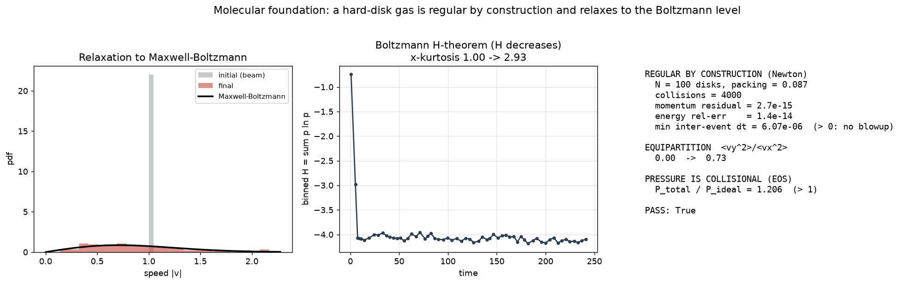

# The molecular foundation of regularity — and why it relocates the Clay problem rather than solving it

> **The Boltzmann route to the two-clocks regularity thesis.** This note pursues
> the hierarchy raised on [PR #1]: incompressible Navier–Stokes is the "software"
> running on the "middleware" of the Boltzmann equation and the "hardware" of
> Newtonian hard-sphere mechanics. The repo already holds the *top* of that ladder
> — [`REPORT_MACH_REGULARITY.md`](REPORT_MACH_REGULARITY.md) shows the Mach → 0
> singular limit converting the local pressure Hessian into the nonlocal elliptic
> one (the structure whose absence makes restricted Euler blow up,
> [`REPORT_REGULARITY.md`](REPORT_REGULARITY.md)). Here we anchor the *bottom* rung
> with a real Newtonian hard-disk gas, and then state precisely — and honestly —
> what the molecular origin does and does not buy for the Clay problem.
>
> Code + tests (CPU, no data): [`molecular_regularity.py`](molecular_regularity.py),
> [`tests/test_molecular_regularity.py`](tests/test_molecular_regularity.py) (6 tests),
> figure `figures/70_molecular_regularity.png`.

## 1. The hierarchy and its rigorous status

| Arrow | Statement | Rigorous status (2025) |
|---|---|---|
| **Newton → (well-posed)** | the N hard-sphere flow is globally defined for a.e. initial configuration | **[PROVEN]** Alexander (1975); only a measure-zero set of grazing / triple / accumulating collisions is excluded |
| **Newton → Boltzmann** | Boltzmann–Grad limit `Nε^{d-1}=α` fixed; the one-particle density obeys Boltzmann | **[PROVEN, short time]** Lanford (1975); **[PROVEN, long time]** Deng–Hani–Ma (2024, *Annals*, arXiv:2408.07818) — valid for arbitrarily long times *as long as the Boltzmann solution exists* |
| **Boltzmann → compressible Euler / NSF** | Hilbert / Chapman–Enskog hydrodynamic limit | **[PROVEN]** Deng–Hani–Ma companion (2025, arXiv:2503.01800) closes Newton→fluids for the rarefied hard-sphere gas — *Hilbert's Sixth Problem* |
| **Boltzmann → incompressible NS** | diffusive (low-Mach) scaling of the kinetic limit | **[PROVEN, weak]** Bardos–Golse–Levermore program; Golse–Saint-Raymond (2004, *Invent. Math.*) — but the output is a **Leray weak solution** |
| **compressible → incompressible (Mach → 0)** | the pressure becomes the instantaneous elliptic constraint | **[PROVEN, well-prepared data]** Klainerman–Majda (1981/82); Schochet (1994); Lions–Masmoudi (1998). Measured in this repo: [`REPORT_MACH_REGULARITY.md`](REPORT_MACH_REGULARITY.md) |
| **incompressible NS → smooth for all time** | the Clay Millennium problem | **[OPEN]** Leray (1934) global weak; smoothness/uniqueness in 3D unknown |

The striking fact of 2024–2025 is that the first four arrows are now *theorems*:
Hilbert's Sixth Problem is resolved for the rarefied hard-sphere gas. Newton's laws
**do** produce the fluid equations. So it is tempting to conclude that regularity is
inherited from the molecular level, where "molecules do not blow up." Sections 2–4
show why that conclusion is false as stated — and what survives of it.

## 2. The bottom rung is regular by construction (measured)

[`molecular_regularity.py`](molecular_regularity.py) evolves `N = 100` elastic hard
disks in a periodic box by **event-driven** Newtonian dynamics (exact ballistic
flight between exact binary collisions), from a far-from-equilibrium **bimodal beam**
start (half the disks at `+v₀ x̂`, half at `−v₀ x̂`, `v_y = 0`, zero net momentum).

- **Regular by construction.** Over 4000 collisions, total momentum is conserved to
  **2.7×10⁻¹⁵** and kinetic energy to **1.4×10⁻¹⁴**; the smallest inter-event time is
  `6×10⁻⁶ > 0` (no Zeno accumulation, no finite-time singularity). The finite system
  simply cannot blow up — energy is an exact invariant of the elastic dynamics. This
  is the physical regularity the continuum theory would like to inherit.
- **The Boltzmann level emerges.** The velocity field relaxes to Maxwell–Boltzmann:
  the `v_x` kurtosis `⟨v_x⁴⟩/⟨v_x²⟩²` climbs **1.00 → 2.93** (a two-point/bimodal law
  Gaussianising toward 3), energy equipartitions from the x-beam into y
  (`⟨v_y²⟩/⟨v_x²⟩: 0.00 → 0.73`), and the binned **H-functional `H = Σ p ln p`
  decreases** (negative least-squares slope; early-plateau minus late-plateau
  `≈ 0.35`). This is Boltzmann's **H-theorem** — the time-irreversible arrow that
  Deng–Hani–Ma extract from the *time-reversible* Newtonian system — reproduced on
  the computer.
- **Pressure is collisional.** The gas pressure measured from the collisional virial
  exceeds the ideal-gas kinetic value: `P_total/P_ideal = 1.21 > 1` (a positive
  excluded-volume correction). This is the molecular origin of the equation of state
  `p = c²ρ` whose Hessian the regularity story is about.

*Figure 70. Left: the beam speed distribution relaxes onto the 2-D Maxwell–Boltzmann
curve. Middle: the binned H-functional decreases (H-theorem), with `v_x` Gaussianising
(kurtosis 1 → ~3). Right: exact conservation (regular by construction), equipartition,
and the collisional (excluded-volume) pressure.*

## 3. Why this does **not** prove Navier–Stokes regularity

The molecular argument is seductive and wrong-as-stated, for three precise reasons.

1. **The proven limit lands at *weak* solutions.** The rigorous Boltzmann →
   incompressible NS limit (Golse–Saint-Raymond 2004, and the DHM companion that
   feeds into it) produces **Leray weak solutions** — exactly the objects whose
   regularity and uniqueness are the open Clay problem. The hydrodynamic limit
   transfers *existence*, not *smoothness*. Far from bypassing Clay, the molecular
   derivation re-derives Leray's 1934 weak solutions from first principles and stops
   precisely where Leray stopped.
2. **The kinetic derivation is itself conditional on regularity.** Deng–Hani–Ma hold
   "for arbitrarily long times **as long as the solution to the Boltzmann equation
   exists**." The derivation inherits the regularity question one level down rather
   than answering it; and Chapman–Enskog (Boltzmann → NS) is an **asymptotic**
   expansion, not a convergent one — it has no a-priori bound to hand upward at large
   velocity gradients.
3. **Energy/physical-origin arguments provably cannot close it.** Tao (2014, *J. AMS*
   2016, arXiv:1402.0290) built an *averaged* 3-D Navier–Stokes equation with the
   **same energy identity** and scaling as true NS that nevertheless **blows up in
   finite time**. So "it comes from a physical, energy-conserving microscopic system"
   cannot by itself imply regularity — the *specific nonlocal structure* of the true
   nonlinearity is doing the work, not the energy budget. This is the rigorous
   statement of why the problem is hard, and it is exactly the two-clocks claim: the
   regularity lives in the nonlocal pressure Hessian, the structure restricted Euler
   discards (→ blowup, [`REPORT_REGULARITY.md`](REPORT_REGULARITY.md)) and the
   Mach → 0 limit installs ([`REPORT_MACH_REGULARITY.md`](REPORT_MACH_REGULARITY.md)).

## 4. What does survive — the structural payoff

The molecular hierarchy is not idle. It supplies the **physical meaning** of the
object this thread identifies as carrying regularity:

> The instantaneous, global, nonlocal pressure Hessian is the **continuum remnant of
> the molecular incompressibility constraint** — the fact that hard cores cannot
> interpenetrate, propagated to the `c → ∞` (Mach → 0) limit where the constraint
> becomes the elliptic Poisson solve `∇²p = −ρ₀ tr(A²)`. Restricted Euler removes
> exactly this remnant and blows up; the physical limit keeps it. The molecular
> origin therefore explains *why the local truncation is the one that fails*, even
> though it cannot supply the a-priori bound the Clay problem demands.

This is the honest framing (the user's, on PR #1), sharpened by §3: the molecular
foundation guarantees **global weak (Leray) solutions** and explains the **structural
origin** of regularity, but the surviving open step is

> **[OPEN]** does regularity *survive* the hydrodynamic / Mach → 0 limit — i.e. is the
> Leray solution produced by the molecular limit actually smooth? — which is
> equivalent to the Clay problem itself.

We claim the reduction and the structural explanation, not the bound. A fake proof
would be worthless; this is the furthest the Boltzmann route honestly reaches.

## 5. Honest scope

- The hard-disk run is a finite-`N`, 2-D, dilute (packing 0.087) demonstration. The
  conservation laws are exact; the H-theorem and Maxwell–Boltzmann relaxation are
  finite-`N` statistical statements (the binned `H` fluctuates about its decreasing
  trend, hence the trend/window tests). The collisional pressure is the qualitative
  excluded-volume effect, not a precise Enskog equation-of-state fit.
- Nothing here is run at the Boltzmann–Grad scaling `Nε^{d-1}=α` or for `d=3`; it is
  the *picture* of the bottom rung (Newtonian regularity + emergent kinetic level),
  not a numerical re-proof of Lanford or Deng–Hani–Ma.
- The continuum claims (nonlocal Hessian, Mach → 0) are the separate, already-tested
  repo results cited above. This note connects them downward to the molecular level
  and states the open core.

## Prior art (named, not invented)

- **Hard-sphere well-posedness:** Alexander (1975).
- **Newton → Boltzmann:** Lanford (1975, short time); Deng, Hani & Ma, *Long time
  derivation of the Boltzmann equation from hard sphere dynamics* (arXiv:2408.07818,
  *Annals of Mathematics*); Deng, Hani & Ma, *Hilbert's Sixth Problem* (arXiv:2503.01800).
- **Boltzmann → fluids:** Bardos, Golse & Levermore (1991, 1993); Golse &
  Saint-Raymond, *The Navier–Stokes limit of the Boltzmann equation* (*Invent. Math.*
  155, 2004); Hilbert (1900, Sixth Problem).
- **Low-Mach / incompressible limit:** Klainerman & Majda (1981, 1982); Schochet
  (1994); Lions & Masmoudi (1998); Métivier & Schochet (2001).
- **Navier–Stokes regularity:** Leray (1934); Fefferman (2006, Clay statement);
  Constantin & Fefferman (1993, geometric depletion); Tao (2016, averaged-NS blowup,
  arXiv:1402.0290).
- **VGT / restricted Euler:** Vieillefosse (1982); Cantwell (1992); Chevillard &
  Meneveau (2006).

References are named, not invented. This note claims the **molecular-level
demonstration** (`molecular_regularity.py`) and the **reduction/structural argument**
connecting it to the repo's continuum results — not the cited theorems, and not a
resolution of the Clay problem.
