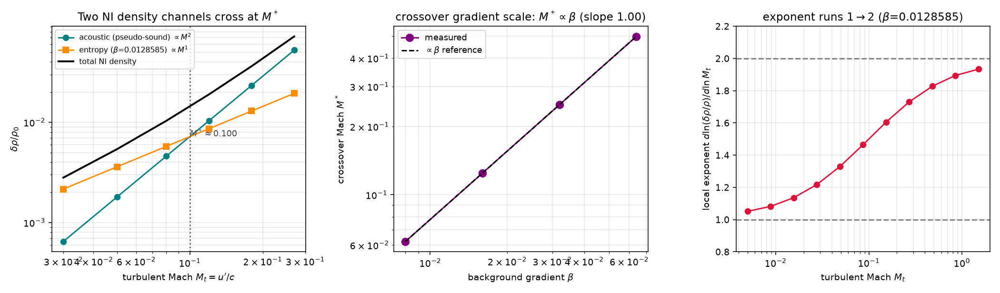

# New cross-relationship — NR37 (`general_two_clocks/new_relationships14.py`)

Continues the derived-and-verified program (NR1–NR36; see
[`papers/CROSS_RELATIONSHIPS_INDEX.md`](../papers/CROSS_RELATIONSHIPS_INDEX.md)).
CPU-only; unit-proofs in
[`tests/test_new_relationships14.py`](tests/test_new_relationships14.py) (9 tests).
Run:

```bash
python general_two_clocks/new_relationships14.py   # -> figures/nr37_pseudosound_crossover.{json,png}
pytest general_two_clocks/tests/test_new_relationships14.py -v
```

---

## NR37 — Part 5's `⟨KE_dil⟩/⟨KE_sol⟩ ~ M²` box law is the **homogeneous** nearly-incompressible limit; a background gradient adds a second density channel that is **linear** in M, and the crossover Mach is **linear in the gradient**  [Zank & Matthaeus 1991 pseudo-sound × Bhattacharjee et al. 1998 / Hunana & Zank 2010 inhomogeneous NI; executes horizon-ledger E4]

### The gap this closes

Part 5 (`REPORT_NS.md`) measured, in the committed isothermal compressible box,
that the dilatational (acoustic) energy fraction and the compressible-minus-
elliptic pressure residual both vanish as **~M²** toward the incompressible
limit. E4's claim: that box law is exactly the **homogeneous** branch of
nearly-incompressible (NI) hydrodynamics (Zank & Matthaeus 1990/1991/1993;
Lighthill 1952's sound-generation mechanism; Montgomery, Brown & Matthaeus
1987), and *adding a mean background gradient must break it to a **linear**
scaling* — the inhomogeneous / heat-flux branch (Bhattacharjee, Ghosh &
Matthaeus 1998; Hunana & Zank 2010). This is the "strongest physics extension"
on the ledger because it (i) embeds a repo result inside a mature theory, and
(ii) yields a **new, falsifiable, fully in-repo** prediction — the crossover
gradient scale — with a fresh external anchor.

### The mainstream frame — two routes to incompressibility  [context]

NI theory expands the compressible equations in the turbulent Mach number
`M_t = u'/c`. There are two distinct density responses:

* **Homogeneous NI (pseudo-sound).** With a uniform background the density is
  slaved to the incompressible (Bernoulli/Poisson) pressure. Through the
  isothermal closure `δp = c²δρ`,
  `(δρ/ρ₀)_acoustic = p_inc/(ρ₀c²)`. Because `p_inc` is a **quadratic**
  functional of velocity (elliptic solve, `p_inc ~ ρ₀u'²`),
  `(δρ/ρ₀)_acoustic ~ u'²/c² = M_t²`.  **[DERIVED]** slope 2.

* **Inhomogeneous / heat-flux NI.** With a mean temperature/entropy gradient,
  the NI density fluctuation **"behaves as a passive scalar driven by the
  dynamics of the incompressible flow field"** (Zank et al. 2017, ApJ 835 147,
  restating Hunana & Zank 2010). A parcel displaced by `δξ ~ u't` across the
  mean gradient carries `T' = -δξ·∇T̄`, hence at constant pressure
  `(δρ/ρ₀)_entropy = -T'/T̄ = β·u't ~ M_t`, with `β ≡ |∇T̄|/T̄`.  **[DERIVED]**
  slope 1.

The committed solver already carries **both** channels: its dynamical density
is the acoustic channel, and its committed mean-gradient passive scalar
(`rhs_forced`'s `-scalar_grad·v` production) **is** the Bhattacharjee-1998
entropy channel — not a proxy for it.

### The new equation — the crossover gradient scale  [DERIVED]

The total NI density fluctuation is the sum
`D(M_t) = a·M_t² + b·β·M_t`. The two channels are equal at

    M_t*  =  (b/a)·β        ⟹    M_t*  ∝  β         (slope 1, exact)

so the Mach separating the low-M (gradient-dominated, `~M¹`) regime from the
high-M (pseudo-sound-dominated, `~M²`) regime is **linear in the background
gradient**. Equivalently the local exponent `d ln D / d ln M_t` runs from 1
(β large / M small) to 2 (β→0 / M large).

### What is measured (in-repo, CPU, deterministic)  [VERIFIED]

One fixed divergence-free field is scaled by amplitude to sweep `M_t = u'/c` at
fixed `c = 8`; the acoustic channel is the incompressible-pressure identity and
the entropy channel is the mean-gradient scalar.

| quantity | prediction | measured |
|---|---|---|
| acoustic channel exponent (leading order) | 2 | **2.00** |
| entropy channel exponent in `M_t` (ballistic) | 1 | **1.00** |
| entropy channel exponent in `β` | 1 | **1.00** (exact: unforced scalar) |
| crossover `M_t*(β)` exponent | 1 | **1.00** (`M_t* = 7.78·β`; e.g. β=0.008→0.062, 0.064→0.498) |
| running exponent `d lnD/d lnM_t` | 1 → 2 | **1.05 → 1.93** (crossover ≈ M 0.1) |
| nonlinear dynamical density exponent | ~2 | **1.95** (survives time evolution) |
| nonlinear scalar exponent | ~1 | **0.88** (ballistic → mild advective saturation at top M) |
| β = 0 control | no entropy channel | scalar rms < 1e-8, exponent undefined; dynamical density still 1.95 |

A buoyancy-on variant (Boussinesq body force `g·θ·ŷ`, `g=3`) confirms the
entropy channel is **robust to feedback**: the scalar rms moves only
`0.908 → 0.625` (same order), so the linear channel is not an artifact of
passivity.

### External anchor  [context; verified citations]

The homogeneous `M²` (Matthaeus, Klein, Ghosh & Brown 1991 "pseudosound") vs
inhomogeneous `M¹` (Bhattacharjee et al. 1998; Hunana & Zank 2010) split was
tested directly in 2025: NASA MMS magnetosheath data (β∼10) and a 10080³
compressible-MHD simulation both find `δρ/ρ₀ ∝ M_t` (linear), *"instead of
quadratic scaling"*, precisely because the background is strongly inhomogeneous
(Zhao/Beattie et al., *ApJL* 2025, doi:10.3847/2041-8213/adbe3b). NR37 is the
in-repo, hydrodynamic-box demonstration of the mechanism that makes that
observation inevitable: the linear channel is the mean-gradient passive scalar,
and it dominates the quadratic pseudo-sound below `M_t* ∝ β`.

### Scope / honesty

This is a **mechanism demonstration** in the committed 2-D isothermal box, not a
full NI-ordered turbulence simulation: it reproduces the two density-channel
**exponents** (2 and 1) and their crossover, using the exact incompressible-
pressure identity (acoustic) and the committed mean-gradient scalar (entropy).
The **absolute** crossover Mach depends on the observation window (`t` vs the
eddy-turnover clock) — itself a two-clocks statement; the robust, falsifiable
content is the **exponents** (2, 1) and the **linear** `M_t* ∝ β` gradient
scale. Does not claim a specific observed proportionality constant, nor 3-D
regularity.

### Figures


