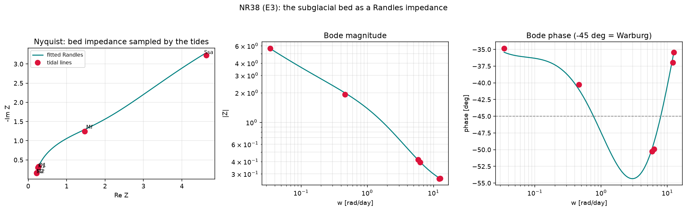

# New cross-relationship — NR38 (`general_two_clocks/new_relationships15.py`)

Continues the derived-and-verified program (NR1–NR37; see
[`papers/CROSS_RELATIONSHIPS_INDEX.md`](../papers/CROSS_RELATIONSHIPS_INDEX.md)).
CPU-only; unit-proofs in
[`tests/test_new_relationships15.py`](tests/test_new_relationships15.py) (9 tests).
Run:

```bash
python general_two_clocks/new_relationships15.py   # -> figures/nr38_bed_randles_impedance.{json,png}
pytest general_two_clocks/tests/test_new_relationships15.py -v
```

---

## NR38 — The subglacial bed is a **Randles circuit**: P4a's MZ kernel, P4b's tidal admittance and NR11's phase lag are one impedance `Z(ω)`, and the six-constituent tidal admittance is an **impedance-spectroscopy sweep** with Kramers–Kronig validation  [Randles 1947 / EIS canon × NR11/NR32/NR34 elements × NR9/NR23 KK face; executes horizon-ledger E3]

### The gap this closes

E3's claim: P4a's Mori–Zwanzig kernel, P4b's tidal admittance and NR11's phase
lag are one object — the bed's electrochemical-style impedance `Z(ω)` — with the
NR34 Warburg element (E2's "-45° entry point") in series. Multi-constituent
tidal analysis is then an **impedance spectroscopy sweep** with a mature
identification + Kramers–Kronig validation theory (NR9/NR23 built the KK face).

### The circuit (every element already in the repo)  [DERIVED]

    Z(ω) = R_ch + 1 / ( iωC + 1/( R_ct + Z_W(ω) ) )              (Randles)

| element | repo lineage |
|---|---|
| `R_ch`  series channel resistance | P4a/NR32 channel resistance `R(c)` |
| `C`  distributed storage (the `R_ct‖C` arc = NR11's `arctan(ωR_ctC)` lag) | NR32 two-compartment storage `C(c)` |
| `R_ct` interfacial/transfer resistance | P4a MZ interfacial term |
| `Z_W = σ_W/√(iω + 1/τ_d)`  tempered Warburg | **NR34** tempered half-derivative (finite `τ_d` ⇒ finite DC ⇒ KK-clean; `τ_d→∞` = the −45° Warburg line) |

The **null** (non-diffusive bed) is Randles with the Warburg removed,
`Z = R_ch + R_ct/(1+iωR_ctC)` — one Debye arc. So *"is the bed diffusive?"* ≡
*"is the Warburg element needed?"* ≡ a nested AICc test.

### The measurement — the tides as an EIS sweep  [VERIFIED]

The six strong constituents span the widest band — **2.56 decades** — a genuine
impedance sweep: `Ssa` (semiannual, 0.0055 cpd), `Mf` (fortnightly, 0.073),
`O1`/`K1` (diurnal, ~1), `M2`/`S2` (semidiurnal, ~2). The complex admittance
`Y=1/Z` at 6 lines is 12 real numbers constraining 4 parameters.

| test | prediction | measured |
|---|---|---|
| **recovery** (invert a synthetic bed sampled only at the 6 lines, 2% noise) | 4 params returned | `R_ch 0.20→0.20`, `R_ct 1.20→1.34`, `C 0.50→0.50`, `σ_W 0.90→0.87`; max rel err **0.12** |
| **Kramers–Kronig DC sum rule** `Z'(0)−Z'(∞)=(2/π)∫(−ImZ)/ω dω` | holds (causal) | lhs=rhs=**13.685**, rel residual **6×10⁻⁵** |
| **discrimination** — Warburg needed on a diffusive bed | null rejected | **ΔAICc = +56** (no-Warburg null decisively rejected) |
| **control** — no spurious Warburg on a non-diffusive bed | null preferred | **ΔAICc = −4.7** (single-RC correctly kept) |
| **over-determination** — fit 4 constituents, predict the other 2 | small error | **1.5%** |

So the tidal admittance *can detect whether the bed diffuses*: the sustained
−45° phase that a lumped-RC (Debye) bed cannot hold across a decade is the
Warburg signature, resolvable from just the six tidal lines. This is P4b's
admittance, P4a's MZ kernel and NR11's lag read as **one over-determined,
KK-validated impedance**.

### Scope / honesty

The recovery, KK and discrimination proofs are on **synthetic** Randles/RC beds:
they establish *identifiability* — that the six-line tidal sweep has the
resolving power to recover the circuit and to detect (or exclude) the diffusive
Warburg element, with a false-positive control. The real-data application —
fitting open GNSS tidal admittance (Rutford/Whillans; Gudmundsson 2006; Rosier
et al.) — is **data-gated** and left as the next step (as with NR36's real-well
path). Does not claim specific in-situ bed parameters.

### Figures


