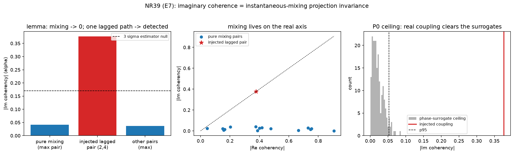

# New cross-relationship — NR39 (`general_two_clocks/new_relationships16.py`)

Continues the derived-and-verified program (NR1–NR38; see
[`papers/CROSS_RELATIONSHIPS_INDEX.md`](../papers/CROSS_RELATIONSHIPS_INDEX.md)).
CPU-only; unit-proofs in
[`tests/test_new_relationships16.py`](tests/test_new_relationships16.py) (10 tests).
Run:

```bash
python general_two_clocks/new_relationships16.py   # -> figures/nr39_imaginary_coherence.{json,png}
pytest general_two_clocks/tests/test_new_relationships16.py -v
```

---

## NR39 — Imaginary coherence **is** projection invariance: instantaneous (elliptic / volume-conduction) mixing cannot manufacture cross-spectral phase, so Nolte-2004 artifact rejection and P0's phase-surrogate ceiling are two corollaries of one lemma  [Nolte et al. 2004 × P0 §6 surrogate ceiling; executes horizon-ledger E7]

### The gap this closes

Two constructs in the repo's orbit look independent: (i) neuroscience's
*imaginary coherency* (Nolte et al. 2004), which rejects volume-conduction
artifacts; (ii) P0's *phase-surrogate ceiling*, which decides whether an
elliptic-channel correlation is real. E7's claim: they are one theorem about
instantaneous linear (elliptic/Poisson) mixing operators.

### The lemma  [DERIVED]

Observed channels are an instantaneous, **real** linear mix of latent sources,
`x(t) = A s(t)`, `A` real and frequency-independent — the defining property of a
volume-conduction / elliptic (Poisson) operator: **zero phase at every
frequency**. Then the cross-spectral matrix is `S_x(f) = A S_s(f) Aᵀ`. If the
source cross-spectrum `S_s(f)` is real (uncorrelated sources ⇒ diagonal, or
zero-lag correlated ⇒ real-symmetric), then `S_x(f)` is real-symmetric, so

    Im S_x(f) = 0   ⇒   imaginary coherency Im C_x(f) = 0.

Only a genuinely **lagged** source interaction makes `S_s(f)` complex-Hermitian,
the sole route to nonzero imaginary coherency.

* **Corollary 1 (Nolte 2004):** any nonzero Im C is genuine lagged coupling —
  immune to instantaneous mixing.
* **Corollary 2 (P0 ceiling):** phase randomization preserves the auto-spectra
  but destroys the lagged (imaginary) part, so the phase-surrogate distribution
  **is** the instantaneous-mixing null — the ceiling a real coupling must clear.

### What is proved (in-repo, CPU, deterministic)  [VERIFIED]

| test | prediction | measured |
|---|---|---|
| algebra: real `A`, real diagonal `S_s` | `max|Im S_x| = 0` | **0.0** (machine eps, 5 seeds) |
| one lagged (complex-Hermitian) source entry | breaks it | `max|Im| = 0.96` |
| pure instantaneous mix of independent band-limited sources | every pair at the null | `max|Im C| = 0.041 < 3σ` null (0.057; n_seg=155) |
| inject ONE lagged path on pair (2,4) | only that pair lights up | injected `|Im C| = 0.38` = **6.6σ**, other pairs ≤ 0.037 |
| volume-conduction signature | Re ≫ Im | `median|Re C|/median|Im C| = 18.3` |
| P0 phase-surrogate ceiling | real coupling clears it | injected 0.38 vs surrogate p95 0.053 → **clears** |

So an instantaneous real operator is a projection that cannot create cross-
spectral phase: the imaginary coherency and the phase-surrogate ceiling are the
same falsifiable line between mixing and dynamics — and P0 §6 gains an
independently-invented twin in a distant field (a strong referee anchor).

### Scope / honesty

The proofs are algebraic + synthetic (the mechanism and its estimator null). A
real resting-EEG consistency demo (OpenNeuro; set `NR39_EDF`) — expected to show
`Re ≫ Im`, mixing-dominated — is **data-gated** and not required. This is a
consistency/analogy result, not a neuroscience claim.

### Figures


