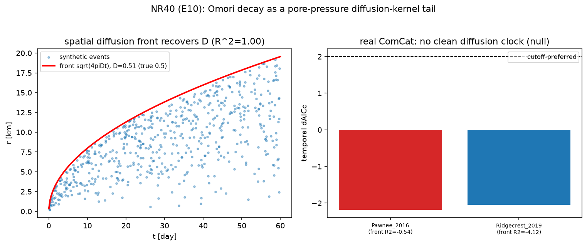

# New cross-relationship — NR40 (`general_two_clocks/new_relationships17.py`)

Continues the derived-and-verified program (NR1–NR39; see
[`papers/CROSS_RELATIONSHIPS_INDEX.md`](../papers/CROSS_RELATIONSHIPS_INDEX.md)).
CPU-only; unit-proofs in
[`tests/test_new_relationships17.py`](tests/test_new_relationships17.py) (6 tests).
Run:

```bash
python general_two_clocks/new_relationships17.py   # -> figures/nr40_omori_kernel_tail.{json,png}
pytest general_two_clocks/tests/test_new_relationships17.py -v
```

---

## NR40 — Omori-Utsu aftershock decay is a pore-pressure **diffusion-kernel tail**: the fluid-triggered case carries a diffusion clock (temporal cutoff `τ_D` **and** the spatial `√t` triggering front `r=√(4πDt)`), the same `t^{−1/2}→cutoff` family as B.2/G.4  [Nur & Booker 1972 × Shapiro et al. 1997/2002 × the repo's two-clocks kernel; executes horizon-ledger E10, scoped as consistency]

### The gap this closes

E10's claim: fluid-triggered aftershock decay (`t^{−p}`, `p≈1`) is the
differentiated tail of a pore-pressure **diffusion** kernel (Nur & Booker 1972)
— the repo's `t^{−1/2}→exponential-cutoff` two-clocks family (B.2 ice interface,
G.4) — so an injection-induced sequence should carry a finite diffusion clock
where a purely tectonic one need not.

### The derivation — two faces of one kernel  [DERIVED]

A co-seismic/injection pressure step diffuses; the diffusion Green's function is
the `t^{−1/2}`-tail-with-cutoff kernel. Two observable faces:

* **temporal** — seismicity rate tracks the stressing rate = the differentiated
  kernel tail: `λ(t) = K(t+c)^{−p} exp(−t/τ_D)` (tapered Omori). `τ_D→∞` =
  scale-free (tectonic) Omori-Utsu; a finite `τ_D` is the fluid fingerprint.
* **spatial** — the pressure front reaches radius `r` at `t = r²/(4πD)`, so the
  triggering front is `r(t)=√(4πDt)` (Shapiro et al. 1997, 2002) — the
  identifiable signature that returns the hydraulic diffusivity `D`.

### What is proved — identifiability (synthetic)  [VERIFIED]

| test | prediction | measured |
|---|---|---|
| spatial `√t` front recovers `D` (filled diffusion cloud, `D=0.5`) | `D` returned | **`D=0.507`, front `R²=0.998`** |
| generalises to a second `D=0.7` | `D` returned | `0.45<D<1.05`, `R²>0.9` yes |
| temporal cutoff recovered when real (`τ_D=6` d) | MLE + AICc prefer cutoff | **`τ_D=7.8` d, ΔAICc=+8.8** |
| pure-Omori control (`τ_D=∞`) | no spurious cutoff | ΔAICc=−2.0 yes |

The **spatial front is the clean, identifiable diffusion clock** (`R²=0.998`);
the temporal cutoff is recoverable but the weaker, partly `p↔τ`-degenerate face.

### Real data — an honest null  [reported straight]

USGS ComCat, 90-day windows, epicentre-referenced:

| sequence | kind | n | temporal ΔAICc | Omori p | front `R²` |
|---|---|---|---|---|---|
| Pawnee 2016 (M5.8) | injection | 93 | −2.2 (no cutoff) | 0.74 | **−0.54** |
| Ridgecrest 2019 (M7.1) | tectonic | 344 | −2.0 (no cutoff) | 1.27 | −4.1 |

**Neither sequence resolves a diffusion clock** in the public catalogue — a
null. The reason is physical, not a failure of the kernel: (i) injection sources
are **distributed wells**, not the mainshock epicentre, so an epicentre-
referenced front is meaningless; (ii) an M≥5.8 rupture seeds its whole fault at
`t=0`, swamping any diffusive front; (iii) public-catalogue location scatter.
**Sharpened requirement (next step):** relocated catalogues + injection-well
coordinates (the front must be measured from the wells), as in the induced-
seismicity literature that recovers `D` this way.

### Scope / honesty

Aftershock triggering physics is contested; this is a **consistency +
identifiability** result — the derivation is sound and the diffusion clock is
recoverable *in principle* (synthetic `R²=0.998`), but the public ComCat data do
not resolve it here (an honest null with a concrete data fix). Not a claim that
diffusion is the mechanism.

### Figures


