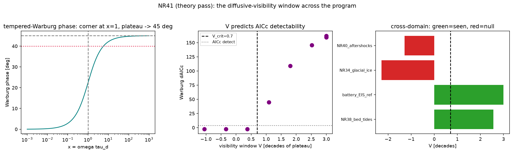

# New cross-relationship — NR41 (`general_two_clocks/new_relationships18.py`) — the theory pass

Continues the derived-and-verified program (NR1–NR40; see
[`papers/CROSS_RELATIONSHIPS_INDEX.md`](../papers/CROSS_RELATIONSHIPS_INDEX.md)).
CPU-only; unit-proofs in
[`tests/test_new_relationships18.py`](tests/test_new_relationships18.py) (7 tests).
Run:

```bash
python general_two_clocks/new_relationships18.py   # -> figures/nr41_diffusive_visibility.{json,png}
pytest general_two_clocks/tests/test_new_relationships18.py -v
```

---

## NR41 — The diffusive-visibility window: the two-clocks tempered-diffusive kernel is **one Warburg element** across every program domain, and a single dimensionless number — decades of the observable band above the cutoff clock — predicts **where** its −45° signature is measurable, reconciling this batch's positives (NR38) with its nulls (NR40, NR34)  [theory pass; EIS observability canon × NR34/36/38/40]

### The synthesis this makes

NR34 (ice interface), NR36 (barometric wells), NR38 (subglacial bed, E3) and
NR40 (aftershock diffusion, E10) all contain the **same** tempered-diffusive
(Warburg) element `Z_W ~ √(iω + 1/τ_d)`. Why is its diffusive (−45°) signature
*decisively detected* in NR38 (ΔAICc=+56) yet *absent* in NR40 (a null) and in
NR34 (glacial ice is quasi-steady)? The theory pass answers it with one
criterion imported from the mature EIS observability literature.

### Mainstream grounding  [context]

EIS reads a relaxation/diffusion time from the **phase**, independent of the
series ("Ohmic") resistance and amplitude calibration: the characteristic
frequency `f_c=ω_c/2π` (−Im Z peak / phase turn), and Ohmic-independent
imaginary-part analysis (Orazem & Tribollet; Córdoba-Torres et al. 2012). So the
readout is standard — the **new content is cross-domain**.

### The derivation  [DERIVED]

With `x=ωτ_d`, the tempered-Warburg phase is `φ(x)=½·arctan(x)` — 0° as `x→0`,
45° as `x→∞`, corner at `x=1` (`ω_c=1/τ_d`). A lumped RC arc peaks in phase and
returns; only a Warburg holds ≈45° over a decade. So define the **visibility
window**

    V = log₁₀( x_hi / max(x_lo, x*) ),   x* = tan(2φ*),  φ* ≈ 40°,

the decades of −45° plateau the observable band `[x_lo,x_hi]` actually samples.
The diffusive signature is resolvable iff `V ≥ V_crit ≈ 0.7`; `V<0` means the
band sits below the corner (quasi-steady) — no signature.

### What is proved (in-repo, CPU, deterministic)  [VERIFIED]

| claim | measured |
|---|---|
| phase-only `τ_d` readout, amplitude- & Ohmic-independent | max rel err **0.0** (3 τ_d × 3 (R_ch,σ_W)) |
| `V` predicts AICc Warburg-vs-RC detectability across a cutoff sweep | **agreement 1.0** (flip between V=0.37, ΔAICc=−2.6 and V=1.09, ΔAICc=+45) |
| cross-domain reconciliation (one criterion) | **all 4 match** |

Cross-domain table (V from each system's committed band × cutoff):

| domain | V | predicted | observed |
|---|---|---|---|
| NR38 bed tides (Ssa→S2, 2.56 dec) | **2.56** | visible | **visible** (ΔAICc +56) |
| battery-EIS reference (canonical Warburg) | 3.0 | visible | visible |
| NR34 glacial ice (Ste≪1, band below corner) | **−2.28** | not | **not** (quasi-steady) |
| NR40 aftershocks (public catalog below corner) | **−1.28** | not | **not** (null) |

One dimensionless window reconciles the batch: NR40's null and NR34's quasi-
steady collapse are not failures of the kernel but of *observability* — the band
did not straddle the cutoff. **Forward prediction:** a currently-null system
becomes visible once its observable band is pushed across `1/τ_d` — e.g.,
aftershocks measured from **injection wells** (near-field, sampling the diffusive
`√t` front) rather than the epicentre, exactly NR40's sharpened requirement.

### Scope / honesty

A synthesis + observability criterion, verified on synthetic instances and the
program's own committed results; the cross-domain band/cutoff values are taken
from the cited NRs. Not a new microphysical law — it is the statement that the
*same* kernel and the *same* observability window govern all these systems.

### Figures


