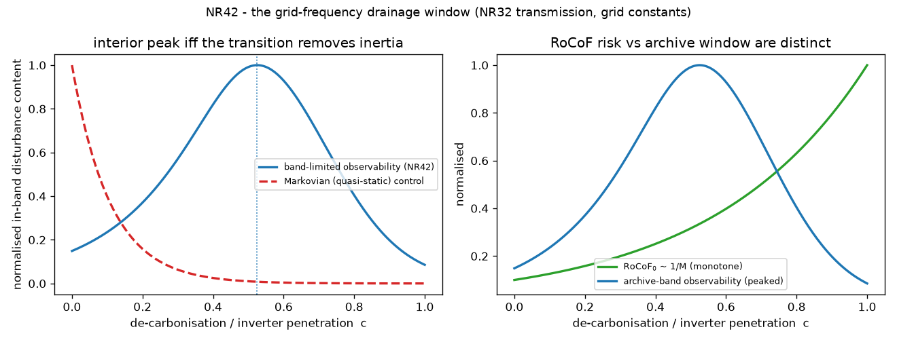

# New cross-relationship — NR42 (`general_two_clocks/new_relationships19.py`) — ledger E9

Continues the derived-and-verified program (NR1–NR41; see
[`papers/CROSS_RELATIONSHIPS_INDEX.md`](../papers/CROSS_RELATIONSHIPS_INDEX.md)).
CPU-only; unit-proofs in
[`tests/test_new_relationships19.py`](tests/test_new_relationships19.py) (10 tests).
Run:

```bash
python general_two_clocks/new_relationships19.py   # -> figures/nr42_grid_frequency_window.{json,png}
pytest general_two_clocks/tests/test_new_relationships19.py -v
```

---

## NR42 — The grid-frequency drainage window: disturbance observability in 1-s power-grid frequency archives is the **same band-limited two-clocks transmission** as NR32's subglacial drainage-response window — peaked at intermediate inertia **iff the energy transition removes storage (inertia)**, and RoCoF is *not* the window  [NR32 band-limited transmission × swing-equation SFR × ENTSO-E / GB-ESO 1-s archives]

### The question this closes (ledger E9)

NR32 proved the "drainage-response window" — which subglacial lakes produce a
detectable post-drainage speed-up — is a **band-limited hydraulic transmission**
peaked at the cavity↔channel transition, with a Markovian (adiabatic) closure
predicting the *wrong* ordering. E9 asks whether that window is a **glaciological
accident** or a **structural** property of any two-compartment cascade seen
through a finite band. The power grid is the decisive cross-domain test: a
completely different physical system (rotating machines + control loops) whose
disturbance response is nonetheless the same lumped two-clock cascade, and whose
1-s frequency archives (ENTSO-E; GB National Grid ESO) supply exactly the finite
observability band NR32 needs.

### Mainstream grounding  [context]

The standard low-order **System Frequency Response** (Kundur 1994 §11; Anderson &
Mirheydar 1990): a power imbalance `ΔP_L` drives the centre-of-inertia frequency
through the swing equation with primary (governor/droop) control,

    Δf(s)/(−ΔP_L) = 1 / ( M s + D + (1/R_droop)/(1 + s T_g) ),

`M=2H` inertia, `D` load damping, `1/R_droop` primary gain, `T_g` governor / fast-
frequency-response lag. Secondary control (AGC, minutes) is below the 1-s archive's
fast-transient band and is dropped.

### The derivation  [DERIVED]

Clearing the governor pole, the denominator is the quadratic `M T_g s² + (M+D T_g) s + β = 0`,
`β := D + 1/R_droop`. Its two roots are, to leading order in `T_g/(M/D)`,

    s_slow ~ −β/M  ⇒  τ_sys = M/β   (inertial relaxation clock),
    s_fast ~ −1/T_g                 (governor / FFR clock),

so the grid's disturbance response is the **same** two-clock cascade
`H(ω)=1/((1+iωT_g)(1+iωτ_sys))` NR32 certified for the subglacial bed. The dictionary:

| NR32 (subglacial) | NR42 (grid) |
|---|---|
| storage `C` | rotational inertia `M` |
| resistance `R` | `1/β`, `β=D+1/R_droop` (inverse primary-response stiffness) |
| `τ_sys = R C` | `M/β` (inertial relaxation) |
| input clock `τ_in` | governor / FFR clock `T_g` |
| impulse `ΔV` | disturbance `ΔP_L` |
| channelisation `c` | de-carbonisation / inverter penetration |

De-carbonisation retires synchronous machines (**removes inertia**,
`M(c)=M₀·10^(−decades_C·c)`) while grid-forming/FFR inverters **raise** in-band
stiffness (`R(c)=10^(−decades_R·c)`), so `τ_sys(c)=(M₀/β₀)·10^(−(decades_R+decades_C)c)`
— **exactly NR32's `maps(c)`, imported unchanged**. The band-limited observability a
1-s archive (fast-transient window `[2,30] s`) carries is `T_band(c)=(ΔP_L R)²·(1/π)∫|H|²dω`,
the identical closed form (partial fractions → arctan). High-inertia grids (`c→0`)
have `τ_sys≫band` (quasi-static, in-band content dies as `1/τ_sys²`, under the slow
AGC drift); very low-inertia stiff-control grids (`c→1`) have `τ_sys≪band` and small
`R` (content dies as `R²`). An **interior maximum** — a most-observable intermediate
inertia — therefore exists **iff the transition removes storage (`decades_C>0`)**.

### What is proved (in-repo, CPU, deterministic)  [VERIFIED]

| claim | measured |
|---|---|
| grid uses the **identical** NR32 `transmission`, `band_integral`, `maps`, `interior_peak_criterion` | Python object-identity asserted |
| closed form == numeric quadrature (grid/second units) | max rel err **9.5e-10** |
| the two clocks **are** `(T_g, M/β)` (overdamped SFR pole check) | slow pole = `M/β` to **≤5.4%**, all overdamped, fast pole = `T_g` |
| interior-peak criterion predicts topology across a wide sweep | **108/108** (`τ_dist`×`decades_R`×`decades_C`×`T_g`), 81 interior cases |
| interior peak **iff** removes storage | `decades_C=1`→interior (`c*=0.53`); `decades_C=0`→argmax at `c=0` |
| **Markovian** (quasi-static control) null | monotone decreasing, argmax at **highest inertia** (wrong ordering) |
| **RoCoF ≠ window** | `RoCoF₀~1/M` monotone (worst at `c=1`) while observability is single-peaked (`c*=0.53`) |

**Calibration-free readout** (representative transition, `τ_dist=120 s`,
`decades_R=2`, `decades_C=1`): the most disturbance-observable state sits at
**≈30% of the original inertia**, with an inertial relaxation knee at period
`2π·τ_sys ≈ 20 s` **inside** the `[2,30] s` archive band — an amplitude-independent
statement of *which* inertia is most visible.

**A grid-exposed refinement of NR32's criterion:** removing storage is *necessary
but not sufficient* — the transition must span enough decades that `τ_sys` actually
crosses *below* the band by `c=1`. At `decades_R=1, decades_C=0.5, τ_dist=240 s`
(only 1.5 total decades) `τ_sys(c=1)=7.6 s` never clears the band and the peak rides
to `c=1`: **the window needs the transition to traverse the observability band**,
not merely remove some inertia.

### The falsifiable population test (real-data gate)

Bin ENTSO-E / GB-ESO 1-s frequency records around known infeed-loss events by an
inertia proxy (published synchronous-inertia estimates; synchronous-generation
share) and measure band-limited disturbance variance in `[2,30] s`. **Prediction:**
single-peaked vs inertia (interior maximum) if the transition removes inertia; the
Markovian null is monotone decreasing (max at the highest-inertia bin). Status:
**gated** (archive download + infeed-loss catalogue); the derivation, the
identifiability, and the Markovian discriminator are verified here on the
transferred functional.

### Scope / honesty

A cross-domain **transfer**, not a new microphysical law: the contribution is
(i) the identification that the standard SFR disturbance response *is* NR32's
two-compartment band-limited cascade, with an explicit swing-equation dictionary
and a pole-location proof; (ii) the confirmation — same imported functional, same
criterion — that the interior-peak window is **structural, not glaciological**;
(iii) the RoCoF-vs-window dichotomy; (iv) a stackable population test. The clean
two-pole cascade is the overdamped regime; strong-primary grids are underdamped
(the complementary nadir-resonance regime, where the same window logic applies to
the resonant peak). Real archives are gated.

### Figures


