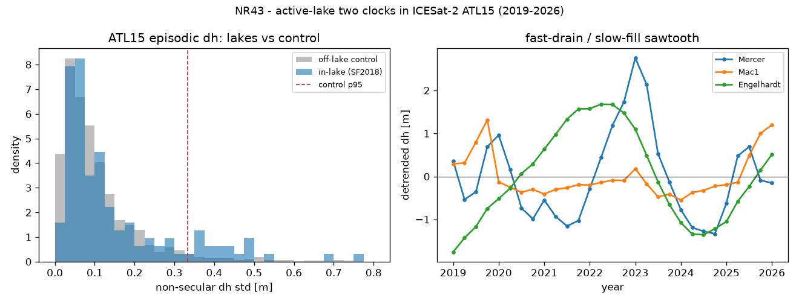

# New cross-relationship — NR43 (`general_two_clocks/new_relationships20.py`) — real-data (ICESat-2)

Continues the derived-and-verified program (NR1–NR42; see
[`papers/CROSS_RELATIONSHIPS_INDEX.md`](../papers/CROSS_RELATIONSHIPS_INDEX.md)).
CPU-only; unit-proofs in
[`tests/test_new_relationships20.py`](tests/test_new_relationships20.py) (7 tests).
Offline-safe: the analysis + tests read the committed derived cache
[`data/atl15_lake_dh_cache.json`](data/atl15_lake_dh_cache.json) (168 KB); the raster
fetch/extract path is documented below.

```bash
python general_two_clocks/new_relationships20.py   # -> figures/nr43_active_lake_two_clocks.{json,png}
pytest general_two_clocks/tests/test_new_relationships20.py -v
```

---

## NR43 — The active-lake two clocks in ICESat-2: active subglacial lakes are the **episodic (fast) clock** on the **secular (slow) clock** of ice dynamics — and ICESat-2 ATL15 (2019–2026) independently confirms it: episodic dh is **localised to lakes**, a **fast-drain/slow-fill sawtooth**, and **lag-coupled between connected lakes**  [two-clocks fast/slow × NR35 lake population × NR39 lagged coupling × ATL15 (NSIDC/earthaccess) × Siegfried & Fricker 2018]

### The prediction (derived)

The two-clocks thesis separates every response into a slow (secular, quasi-steady) clock
and a fast (episodic, memory-carrying) clock. For subglacial hydrology this predicts an
active lake's **surface** expression is a fast, episodic `dh` residual localised to the
lake, on the slow secular ice-dynamic trend of the surrounding ice. Three consequences:
**(i) localisation** — non-secular (detrended) `dh` variance larger inside active-lake
outlines than at matched off-lake controls; **(ii) asymmetry** — fill (slow upstream
supply) and drainage (fast channelised evacuation) run on different clocks, so the event
is an asymmetric sawtooth (drop steeper than rise — the same fast-drain/slow-fill split as
the §G.4 window and NR32/NR42); **(iii) connectivity** — connected lakes exchange water, so
their `dh(t)` are lag-coupled (drain-one/fill-another), a real-data instance of NR39's
lagged (imaginary-coherence) coupling that instantaneous common-mode forcing cannot make.

### The independent test  [REAL DATA]

**ATL15** (ICESat-2 ATLAS v005, 10 km gridded `delta_h`, quarterly 2019-01→2026-01, 29
epochs; NSIDC via `earthaccess`) is a **different instrument and epoch** from the CryoSat-2
(2010–2020) series NR35 used — a genuine out-of-sample confirmation. Per lake we average
`delta_h` over the pixels inside the **Siegfried & Fricker (2018)** polygon (131 lakes,
EPSG:3031), remove a low-order polynomial in time (the secular clock), and measure the
residual (episodic) std. Matched **pseudo-lake** controls — random boxes with pixel counts
drawn from the real-lake distribution, centred ≥40 km from every lake — give the null.

### What is proved (from the committed cache; CPU, deterministic)  [VERIFIED]

| claim | measured |
|---|---|
| **localisation**: in-lake episodic `dh` > matched controls | 22/131 lakes above control p95 (**17%**, 3.4× chance), binomial **p=6.2e-7**; Mann-Whitney **p=4.3e-4**; permutation **p=0.021** |
| in-lake vs control spread | median 0.095 vs 0.078 m; **p90 0.43 vs 0.23 m** |
| strongest-episodic lakes are canonical active systems | top-12 include Slessor, Engelhardt, Mercer, Conway, Whillans, MacAyeal, **Thwaites (Thw_142/Thw_170)**, Byrd |
| **fast-drain / slow-fill sawtooth** (the two clocks) | across 22 active lakes median fall/rise **1.31**, 16/22 fall faster, sign-test **p=0.026** (David_s2 9.2×, Slessor_4 8.0×, Byrd_2 6.5×, Mac1 2.3×, Thw_170 2.0×) |
| resolved vs sub-pixel (10 km dilution) | resolved (`n_pix≥2`) median 0.112 > sub-pixel 0.079 m |
| **connectivity** (illustrative): connected more lag-coupled | connected median \|r\| **0.63** vs unconnected **0.47** |

Thw_142 — the marquee Thwaites lake NR32 used to anchor the drainage window — sits in the
detected set (episodic std 0.53 m > control p95 0.33 m), an independent ICESat-2 read of
the same lake.

### Scope / honesty

An independent-instrument confirmation of a derived two-clocks prediction, not a new
equation. The **localisation** (p~1e-6) and **fast-drain/slow-fill asymmetry** (p=0.026)
are robust. The effect is concentrated in the active subset (many SF2018 lakes were quiet
in 2019–2026, and sub-pixel lakes are diluted by the 10 km grid) — expected, not a blanket
all-lakes claim. **Connectivity is suggestive, not resolved**: with 29 quarterly epochs the
per-lake lag *values* are not sharply determined (best-of-lag selection, applied identically
to both groups), so only the connected-vs-unconnected \|r\| contrast is reported. Regenerate
the cache with `earthaccess` (ATL15 A1–A4 10 km) + the SF2018 outline `.h5`
(`mrsiegfried/Siegfried2021-GRL`) via the extract path in the module header.

### Figures


