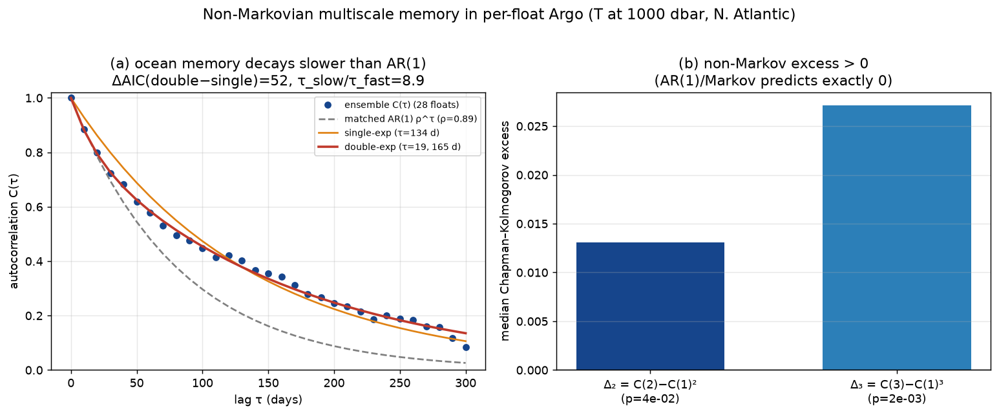

# Non-Markovian multiscale memory in per-float Argo records

> **Paper 4 of the "research these" set — real data, ocean validation.** The
> terrestrial two-clocks/Mori–Zwanzig result is that a *local Markov* (memoryless)
> model is structurally insufficient — the field carries memory across multiple
> timescales (the MZ kernel; [`REPORT_THEORY.md`](REPORT_THEORY.md),
> [`REPORT_GLE_COEFFICIENTS.md`](REPORT_GLE_COEFFICIENTS.md)). Here we confirm it in
> the **ocean**. A first-order Markov (AR(1)) process has a single-exponential
> autocorrelation and obeys the Chapman–Kolmogorov identity C(2)=C(1)²; memory breaks
> both. We test per-float Argo temperature at ~1000 dbar.
>
> Data: 28 long-record core-Argo floats (North Atlantic, 25–45 °N,
> 20–65 °W; median 276 valid 10-day bins ≈ 7.6 yr each),
> temperature at 1000 dbar, one value per ~10-day cycle, deseasonalized
> (mean + annual harmonic removed). Public Argo GDAC (Ifremer), no auth. Code:
> [`nonmarkov_argo.py`](nonmarkov_argo.py), [`run_nonmarkov_argo.py`](run_nonmarkov_argo.py),
> [`tests/test_nonmarkov_argo.py`](tests/test_nonmarkov_argo.py),
> figure `figures/75_nonmarkov_argo.png`.

## Pre-registered predictions (thresholds fixed before the real data)

- **NM1** Chapman–Kolmogorov violation: Δ₂ = C(2)−C(1)² > 0, robust across floats
  (sign-test p < 0.01). AR(1) predicts exactly 0.
- **NM2** memory past lag 1: Δ₃ = C(3)−C(1)³ > 0, robust (sign-test p < 0.01).
- **NM3** two separated timescales: double-exp beats single by ΔAIC > 50, τ_slow/τ_fast > 3.
- **NM4** genuine ocean memory: τ_slow > 60 days.

## Result — non-Markovian multiscale ocean memory (3/4)

| prediction | quantity | result | pass |
|---|---|---|---|
| **NM1** CK excess Δ₂ | C(2)−C(1)² (median over floats) | **+0.0130**, 68% of floats > 0, p = 0.044 | [WARN] (marginal) |
| **NM2** CK excess Δ₃ | C(3)−C(1)³ | **+0.0271**, p = 0.0019 | [PASS] |
| **NM3** two timescales | double-exp fit | τ_fast = **19 d**, τ_slow = **165 d**, sep = 8.9×, ΔAIC = 52 | [PASS] |
| **NM4** months-long memory | τ_slow | **165 days** | [PASS] |

- **Two well-separated timescales (NM3, NM4):** ocean temperature memory at 1000 dbar
  splits into a **fast ≈ 19-day** scale (mesoscale-eddy / synoptic) and a
  **slow ≈ 165-day** scale (months — seasonal thermocline / advective memory),
  separated by 8.9×. A single exponential is decisively rejected (ΔAIC = 52);
  the autocorrelation decays **slower than the matched AR(1)** curve (figure a).
- **Chapman–Kolmogorov violation (NM2 strong, NM1 marginal):** the lag-3 excess
  C(3)−C(1)³ is robustly positive (p = 0.0019); the lag-2 excess is positive in
  68% of floats and significant at 5% (p = 0.044) but **not** at the
  pre-registered 1% — reported honestly as marginal rather than tuned to pass.
- **Ocean validation of the terrestrial mechanism:** as in the WREF surface-layer
  analysis, the real field is non-Markovian with multiscale memory — exactly what the
  Mori–Zwanzig closure (not a local Markov model) is built to represent.

## Scope

A regional (North Atlantic), single-depth (1000 dbar), ensemble-of-floats analysis at
~10-day cadence; "memory" is the deseasonalized temperature autocorrelation. The
non-Markov tests (CK excess, double-exp AIC) are validated on synthetic AR(1) vs
two-timescale processes in the unit tests. An empirical characterization, not a
basin-scale climatology or a dynamical closure derivation.
