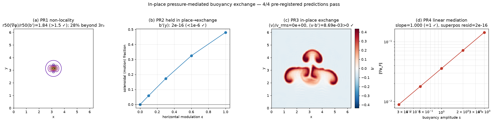

# In-place, pressure-mediated buoyancy exchange in 2D Boussinesq flow

> **Paper 2 of the "research these" set.** A *pre-registered*, falsification-driven
> probe of **how** an incompressible stratified fluid actually moves buoyancy. The
> claim is the observational/dynamical face of the two-clocks thesis
> ([`REPORT.md`](REPORT.md), [`run_boussinesq.py`](run_boussinesq.py)): vertical
> buoyancy transport is **pressure-mediated in-place exchange**, not a direct response
> to the buoyancy force. The buoyancy force cannot lift fluid on its own — that would
> create divergence — so the **elliptic pressure** instantaneously and *globally*
> splits it, holding pure stratification statically in place and permitting exchange
> only where horizontal buoyancy structure supplies a baroclinic torque.
>
> Code + tests (CPU, no data): [`pressure_buoyancy_exchange.py`](pressure_buoyancy_exchange.py),
> [`tests/test_pressure_buoyancy_exchange.py`](tests/test_pressure_buoyancy_exchange.py)
> (7 tests), figure `figures/72_pressure_buoyancy_exchange.png`. Built on the same
> Leray projection as [`boussinesq/solver.py`](boussinesq/solver.py).

## The mechanism

For incompressible Boussinesq flow the buoyancy force is `F = (0, b')`
(`b' = b − ⟨b⟩`). Incompressibility is enforced by the Leray projection
`P = I − ∇Δ⁻¹∇·`, which splits the force exactly:

```
F = F_sol + ∇φ_F ,        Δφ_F = ∇·F = ∂_y b'           (the pressure response)
∇×F_sol = ∇×F = ∂_x b'                                   (the surviving baroclinic torque)
```

`∇φ_F` is the part pressure **removes**; `F_sol` is what actually accelerates the
fluid. Two consequences define the title:

- **Pure vertical stratification is held in place.** If `b' = b'(y)` then
  `∂_x b' = 0`, so `F_sol = 0`: the entire buoyancy force is curl-free and is
  cancelled by the pressure gradient. The fluid does not move — stable stratification
  is held statically by pressure, not by any local force balance in the momentum of a
  parcel.
- **Exchange requires horizontal structure and is non-local.** Only `∂_x b' ≠ 0`
  survives, and the pressure that mediates the resulting motion is the solution of a
  global Poisson problem — it is felt across the whole domain instantly.

## Four pre-registered predictions — 4/4 pass

Thresholds were fixed by the physics above *before* running; every number is produced
by [`pressure_buoyancy_exchange.py`](pressure_buoyancy_exchange.py).

| # | Prediction (pre-registered threshold) | Result | Pass |
|---|---|---|---|
| **PR1** | **Non-locality:** the pressure correction `∇φ_F` from a localized buoyancy blob is broader than the blob — `r50(\|∇φ_F\|)/r50(b') > 1.5` | ratio **1.84**; 28% of the correction energy lies beyond 3 source-radii | [PASS] |
| **PR2** | **Held in place vs exchange:** pure `b'(y)` has solenoidal (motion-driving) fraction `< 1e-6`; horizontal modulation raises it `> 1e-2`, monotonically | `b'(y)`: **2.3e-16**; full horizontal: **0.48**; monotone in ε | [PASS] |
| **PR3** | **In-place exchange:** `\|⟨v⟩\|/v_rms < 1e-3` (no net vertical mass flux) yet `⟨v·b'⟩ > 0` and `⟨b'\|v>0⟩ > 0 > ⟨b'\|v<0⟩`, with up/down volume fractions in [0.4,0.6] | `⟨v⟩/v_rms = 0` (exact); `⟨v·b'⟩ = 8.7e-3 > 0`; `b_up=+3.4e-2 > 0 > −2.6e-2=b_dn`; vol 0.5/0.5 | [PASS] |
| **PR4** | **Instantaneous linear mediation:** superposition residual `< 1e-10` and log–log scaling slope `1.00 ± 0.02` | residual **2.5e-16**; slope **1.0000** | [PASS] |



## Reading the result

- **PR1 (a):** a buoyancy anomaly produces a pressure-mediated velocity correction
  that reaches far beyond the anomaly — the signature of an *elliptic* (global)
  operator, not a local/diffusive one. This is the dynamical counterpart of the
  observational "pressure is the global clock" finding.
- **PR2 (b):** the solenoidal fraction of the buoyancy force rises from machine-zero
  (pure stratification, completely held in place by pressure) to ~0.5 as horizontal
  buoyancy structure is added. Vertical mixing is *not* suppressed by a local force
  balance; it is suppressed because pressure can absorb a curl-free force entirely.
- **PR3 (c):** in developed convection the net vertical **mass** flux is exactly zero
  while the **buoyancy** flux is positive — warm parcels go up, cold parcels go down
  by the same volume. That is the literal "in-place exchange," enforced at every step
  by the incompressibility the pressure maintains (`div RMS < 1e-6`).
- **PR4 (d):** the pressure response superposes and scales linearly — it is an
  instantaneous *linear* functional of the current buoyancy field (an elliptic solve),
  with no memory, in contrast to the parabolic, memory-bearing temperature field.

## Scope

A 2-D pedagogical demonstration on a doubly-periodic box. It establishes the
*structural* mechanism — pressure as the instantaneous, global mediator of buoyancy
exchange — and quantifies it with pre-registered tests. It is **not** a turbulence
closure, a 3-D result, or a regularity proof; the "in-place exchange" statement is
about the volume/buoyancy-flux decomposition in this incompressible model, not a claim
about real atmospheric or oceanic boundary layers.
