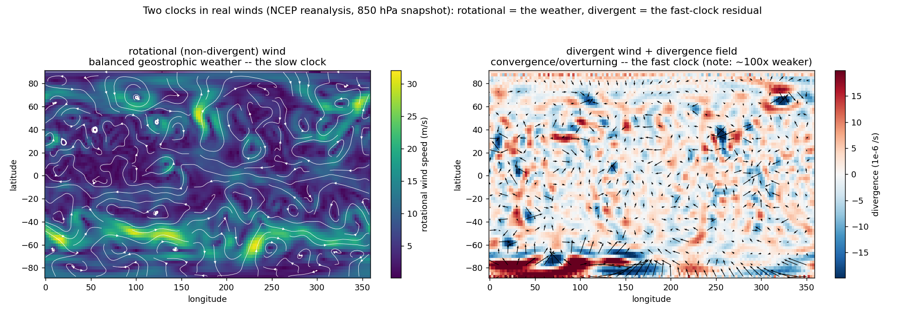
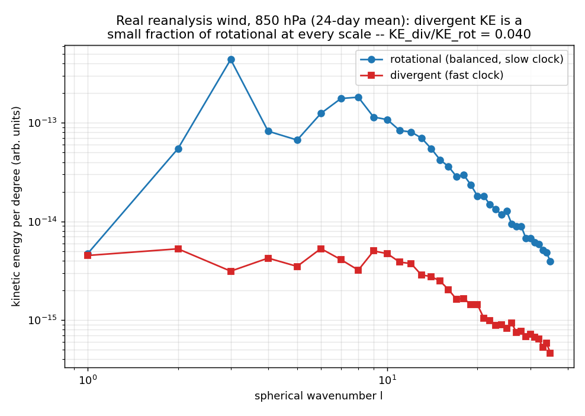
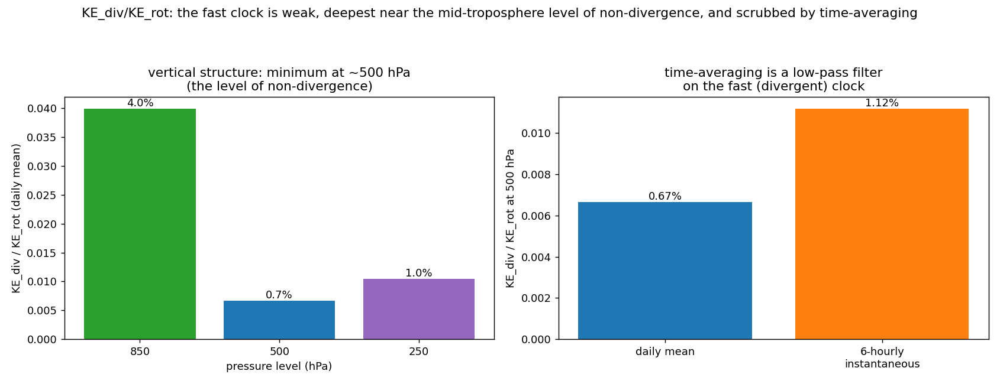

# Part 7 -- the two clocks in real reanalysis winds
 
**Data:** NCEP/NCAR Reanalysis 1 (Kalnay et al. 1996), 2.5 deg, fetched live from
NOAA PSL over OPeNDAP (no credentials).  Parts 5-6 split a *synthetic* compressible
flow into a slow solenoidal part and a fast dilatational (acoustic) part.  Here the
same idea is applied to *real* horizontal winds via the Helmholtz split into a
rotational (non-divergent) part and a divergent part.
 
**Honesty note.**  Horizontal wind divergence is *not* a model artifact: by 3-D
mass continuity, du/dx + dv/dy = -dw/dz, it is the genuine footprint of vertical
motion.  So the diagnostic is the *Helmholtz split* -- how much kinetic energy lives
in the divergent (fast) versus rotational (slow) part -- not the raw divergence.
 
## 1. One snapshot: the weather is rotational; the fast clock is a weak residual
 

 
The rotational wind (left) *is* the synoptic weather -- the balanced, geostrophic
highs and lows.  The divergent wind (right) is ~100x weaker and concentrated in
convergence/overturning zones (tropical convection bands, storm inflow): the
fast-clock footprint, the real-atmosphere analogue of the dilatational velocity.
 
## 2. The kinetic-energy spectrum: divergent << rotational at every scale
 

 
Splitting the kinetic energy by spherical wavenumber l (from the SH power spectra of
vorticity and divergence, weighted by 1/(l(l+1))), the divergent branch sits well
below the rotational branch at all scales.  Integrated, **KE_div/KE_rot = 0.040**
at 850 hPa -- the real-data echo of the KE_dil/KE_sol ~ M^2 << 1 result from Parts 5-6.
 
## 3. Vertical structure and the low-pass-filter point
 

 
| level | KE_div/KE_rot (daily mean) |
|---|---|
| 850 hPa | 3.99% |
| 500 hPa | 0.67% |
| 250 hPa | 1.04% |
 
- The divergent fraction is **smallest near 500 hPa** -- the classical *level of
  non-divergence* -- and larger in the boundary layer (850 hPa, convergence into
  lows) and the upper-level jet/outflow (250 hPa).  The physics, not a tuning, sets
  this.
- At 500 hPa the **6-hourly instantaneous** ratio (1.12%) exceeds the
  **daily-mean** ratio (0.67%): time-averaging is a low-pass filter
  that scrubs the fast divergent clock -- exactly the move that recovered the elliptic
  pressure field in Part 5 (averaging over the acoustic period).
 
## Scope
 
Reanalysis is a model-assimilated product, not raw observation, and 2.5 deg resolves
only large scales (l <= 35).  This is a real-data *confirmation* that the wind's
energy is overwhelmingly in the slow rotational clock with a weak, physically
structured fast divergent clock; it is not a turbulence-closure or 3-D regularity
claim.
