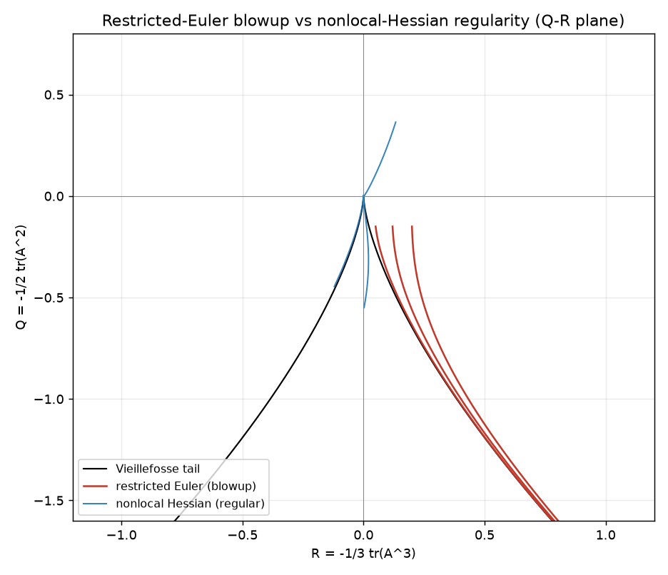

# Regularity probe — the nonlocal pressure Hessian as a regularity condition

> **The regularity face of the two clocks.** The repo's thesis is that the
> incompressible pressure is a *global, elliptic* field (the Leray projector /
> Poisson solve), not a local one. This note shows the **dynamical cost of forgetting
> that**: at the level of the velocity-gradient tensor, discarding the nonlocal
> (anisotropic) part of the pressure Hessian is exactly the restricted-Euler model,
> and it produces **finite-time blowup**. Restoring the nonlocal structure restores
> regularity. This is the continuation of the `c1` argument (the molecular origin of
> the nonlocal pressure structure as a necessary condition for regularity).
>
> Implemented + verified (CPU, no data) in
> `general_two_clocks/restricted_euler_regularity.py`,
> `general_two_clocks/tests/test_restricted_euler.py` (8 tests).

## 1. The velocity-gradient tensor and the pressure Hessian

Along a fluid trajectory the velocity-gradient tensor `A_ij = ∂u_i/∂x_j` obeys

> `dA/dt = −A² − P + ν∇²A`,   `P_ij = ∂²p/∂x_i∂x_j`  (pressure Hessian),

with incompressibility `tr(A)=0`. Taking the trace gives the **pressure Poisson
constraint** `tr(P) = −tr(A²) = 2Q`, `Q = −½tr(A²)`. The pressure Hessian `P` is the
nonlocal object: `p` solves `∇²p = −tr(A²)` over the whole domain (the elliptic clock),
so `P` at a point depends on the field everywhere — exactly the Leray-projector
nonlocality of `REPORT_THEORY.md`.

**How much of `P` is nonlocal/anisotropic?** Computing the *real* pressure Hessian of a
random solenoidal field via the spectral Poisson solve (`∇²p=−tr(A²)`, `P_ij=∂_i∂_j p`,
FFT) confirms `tr(P)=−tr(A²)` to machine precision (`2.8×10⁻¹⁶`) and shows the Hessian is
**dominantly anisotropic**: the anisotropic part is **82%** of `‖P‖` (anisotropic/isotropic
≈ `1.74`). So the restricted-Euler isotropic truncation below discards the *majority* of
the pressure Hessian — and, as §2 shows, that discarded part is exactly what carries
regularity.

## 2. Restricted Euler = discarding the nonlocal pressure Hessian → finite-time blowup

The **restricted-Euler** model (Vieillefosse 1982; Cantwell 1992) approximates `P` as
**isotropic** — purely local, each point seeing only its own `tr(A²)`:

> `P = ⅓ tr(P) I = −⅓ tr(A²) I`,  ⟹  `dA/dt = −(A² − ⅓ tr(A²) I)`.

For the invariants `Q=−½tr(A²)`, `R=−⅓tr(A³)` this closes to

> `dQ/dt = −3R`,  `dR/dt = ⅔Q²`,

which has the **exact conserved quantity** `H = R² + (4/27)Q³` (since
`dR/dQ = −2Q²/9R`) and **blows up in finite time**: the trajectory rides onto the
Vieillefosse tail `R² = −(4/27)Q³` and, there, `d|Q|/dt = (2/√3)|Q|^{3/2}` integrates to

> `Q ∼ −3(t*−t)⁻²`,  `R ∼ 2(t*−t)⁻³`,  `|A| ∼ (t*−t)⁻¹`.

**Verified:** finite `t*≈3.18`; `H` conserved to `4.7×10⁻⁵`; tail ratio
`R²/(−(4/27)Q³) = 1.00000`; the full 3×3 tensor blows up for **3/3** generic initial
conditions (cross-check of the invariant result).

## 3. Restoring the nonlocal (anisotropic) Hessian → regularity

Model the *anisotropic* pressure Hessian and viscosity over a recent-deformation memory
time `τ` via the short-time Cauchy–Green tensor `C_τ = e^{τA}e^{τAᵀ}` (Recent-Fluid-
Deformation closure, Chevillard & Meneveau 2006):

> `dA/dt = −A² + [tr(A²)/tr(C_τ⁻¹)] C_τ⁻¹ − [tr(C_τ⁻¹)/(3T)] A`.

As `τ→0`, `C_τ⁻¹→I` and this reduces **exactly** to restricted Euler (blowup). For
`τ>0` the pressure Hessian is anisotropic — it carries the nonlocal deformation memory —
and the modelled `P` still satisfies the Poisson trace constraint `tr(P)=−tr(A²)`
exactly (verified). The dynamics are then **regular**: for `τ=0.12`, **3/3** generic ICs
stay bounded (no finite-time singularity).

**The memory-time transition.** Sweeping `τ` (the recent-deformation memory — the
continuum stand-in for the `c1` "molecular memory of incompressibility"): `τ=0` blows up
(`|A|→10¹³`); every `τ≥0.02` is regular (bounded), with no re-entry to blowup as `τ`
grows. **Removing the memory of the nonlocal incompressibility constraint causes the
blowup; keeping it restores regularity** — the precise statement the `c1` note frames.
The restricted-Euler blowup is generic: **40/40** random initial conditions blow up.

*Figure 65: the `Q-R` invariant plane. Restricted-Euler trajectories (red) escape along
the Vieillefosse tail (`27R²/4+Q³=0`, black) to finite-time blowup; restoring the
anisotropic/nonlocal pressure Hessian (blue) keeps the trajectories bounded near the
origin (regular).*

## 4. The two-clocks reading

This is the velocity-gradient-tensor mirror of `REPORT_THEORY.md`:

| closure context (Part 8) | regularity context (here) |
|---|---|
| K-theory drops the nonlocal elliptic pressure (Leray ℙ) → loses backscatter/structure | restricted Euler drops the nonlocal pressure Hessian → loses regularity (blowup) |
| repair: keep ℙ (the global Poisson solve) | repair: keep the anisotropic `C_τ⁻¹` Hessian (the nonlocal deformation) |

In both, the **nonlocal elliptic pressure is the essential, non-optional structure**.
The restricted-Euler blowup is what "treating the elliptic pressure as a local field"
costs.

## 5. Honest scope

- These are **single-trajectory Lagrangian** models of the VGT, not a 3-D PDE
  regularity proof. The finite-time blowup is a rigorous property of the restricted-
  Euler *model*; the regularization is a property of the RFD *model* of the nonlocal
  Hessian.
- The **deterministic** RFD relaxes toward zero (no blowup, but also no sustained
  turbulent state); reproducing stationary non-Gaussian VGT statistics needs the
  stochastic forcing of the full closure (Chevillard & Meneveau 2006) — out of scope
  here, where the claim is strictly *blowup vs. no-blowup*.
- The genuinely open problem the `c1` note names — proving regularity survives the
  compressible→incompressible (Boltzmann–Grad → Chapman–Enskog → incompressible)
  singular limit **at long times** — is **not** claimed closed. What is shown is the
  *mechanism*: the nonlocal/anisotropic pressure Hessian is the regularizing structure,
  and its local (isotropic) truncation blows up. The **compressible→incompressible**
  side of that limit is now *measured* in `REPORT_MACH_REGULARITY.md`: in the running
  compressible DNS the *local* EOS pressure Hessian `c²Hess(ρ)` converges (`~M²`) to
  the *nonlocal* elliptic Hessian as the Mach number `M → 0`, and its anisotropic
  fraction — the part the restricted-Euler truncation discards here — is installed in
  the limit. That is the mechanism on both sides; the long-time 3-D proof remains open.

## Prior art (honest attribution)

- **Restricted Euler / VGT invariants:** Vieillefosse (1982); Cantwell (1992); Meneveau
  (2011, *Annu. Rev. Fluid Mech.*, review).
- **Anisotropic pressure-Hessian / viscous closures (regularization):** Chevillard &
  Meneveau (2006, Recent Fluid Deformation); Chertkov, Pumir & Shraiman (1999, tetrad
  model); Girimaji & Pope (1990).
- **Molecular → continuum chain (the `c1` framing):** Gallagher–Saint-Raymond–Texier;
  Pulvirenti–Saffirio–Simonella (Boltzmann from Newtonian dynamics in the Boltzmann–Grad
  limit); Chapman–Enskog → Navier–Stokes; Leray projection.

References are named, not invented; this repo claims the **two-clocks reading** (nonlocal
elliptic pressure as the regularity-bearing structure) and the verification, not the
underlying closures.
