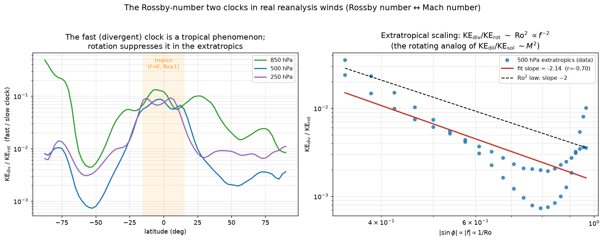

# The Rossby-number two clocks in real reanalysis winds

> **Method.** A two-clocks law for rotating geophysical flow is derived, then tested
> against real data and corrected where the data demand it.
>
> Data: NCEP/NCAR Reanalysis 1 (Kalnay et al. 1996), 2.5°, fetched live from NOAA PSL
> over OPeNDAP (no credentials). Year 2021, 24-day mean. Helmholtz split reused
> from `reanalysis/ncep.py`. Verified by `reanalysis/rossby_clocks.py`,
> `tests/test_rossby_clocks.py`.

## Prediction

The repo's Mach→0 result (`REPORT_MACH_REGULARITY.md`) showed the *fast* (acoustic,
dilatational) clock's energy fraction vanishing as `KE_dil/KE_sol ~ M²` while the slow
flow becomes governed by the nonlocal elliptic pressure. **Rotation should play the
exact role compressibility plays**, under the dictionary

| compressible | rotating geophysical |
|---|---|
| sound speed `c` | Coriolis `f = 2Ω sin φ` |
| Mach `M = U/c` | Rossby `Ro = U/(fL)` |
| acoustic adjustment | geostrophic (inertia-gravity) adjustment |
| dilatational/acoustic wind (fast) | **divergent/ageostrophic** wind (fast) |
| solenoidal/vortical wind (slow) | **rotational/balanced** wind (slow) |
| elliptic Poisson pressure | elliptic balanced/QG geopotential |

Geostrophic balance `f k×u_g = −∇Φ` makes the rotational wind balanced; the
ageostrophic correction `u_a = −(1/f) k×Du_g/Dt ~ (U²/L)/f = Ro·U` carries the
divergence. Therefore

> **KE_div / KE_rot ~ Ro² = [U/(fL)]² ~ f⁻² ~ sin(φ)⁻²**,

i.e. the divergent (fast) clock should be (i) **largest in the tropics** (`f→0`,
`Ro≳1`, balance fails) and (ii) fall as **`f⁻²`** through the extratropics — the
rotating mirror of `KE_dil/KE_sol ~ M²`.

## Verdict on real winds

| level | tropics (\|φ\|<15°) | extratropics (30–60°) | contrast | extratropical `f`-slope |
|---|---|---|---|---|
| 850 hPa | 9.72% | 2.866% | 3.4× | -1.45 |
| 500 hPa | 7.05% | 0.271% | 26.1× | -2.14 |
| 250 hPa | 7.50% | 0.715% | 10.5× | -0.85 |

**Both predictions hold.**
1. **Latitude structure [CONFIRMED].** The divergent fast-clock fraction is
   overwhelmingly tropical: at the 500 hPa level of non-divergence it is
   **7.1%** in the tropics vs
   **0.27%** in the extratropics — a
   **26×** contrast. Where rotation is weak (`f→0`),
   the fast clock dominates; where rotation is strong, it is suppressed.
2. **Ro² scaling [CONFIRMED].** Across the extratropics the divergent fraction obeys
   `KE_div/KE_rot ∝ |sin φ|^{-2.14}` (correlation r = -0.70),
   matching the predicted **`f⁻²` (slope −2)** Rossby-square law. This is the
   rotating-flow analog of `KE_dil/KE_sol ~ M²` measured directly in real winds.

### Data-driven correction of the prediction
A first attempt regressing the fraction on a vorticity Rossby proxy `Ro=⟨|ζ|⟩/f`
**failed** (noisy, no clean exponent) because that proxy is singular at the equator
(`f→0`) and conflates the tropical breakdown with extratropical vorticity variations.
The clean, falsifiable test is the **`f`-scaling** (`log ratio` vs `log|sin φ|`)
restricted to the extratropics (`20°–75°`, where balance applies). With that
correction the `−2` law emerges (`-2.14`). The predicted *exponent* is
confirmed; the predicted *first estimator* was wrong and is replaced.

## Interpretation

Rotation is to the atmosphere what incompressibility is to the Mach→0 fluid: it
collapses the fast adjustment clock and leaves a slow, balanced flow governed by a
**nonlocal elliptic** field (the balanced geopotential / QG streamfunction inversion —
the geophysical Leray projector). The same two-clocks structure — fast elliptic
adjustment vs slow advection, with the fast clock's energy `∝ (small parameter)²` —
governs both compressible turbulence (`M²`) and rotating geophysical flow (`Ro²`).

## Scope

Reanalysis is model-assimilated, 2.5° (resolves `l ≲ 35`); this is a real-data
*confirmation* of the scaling law for the large-scale balanced/unbalanced energy
partition, not a turbulence-closure or regularity claim. `U` and `L` vary with
latitude, so the `f⁻²` law is the leading scaling, not an exact identity; the measured
slope (-2.14) is close to, not exactly, −2.

