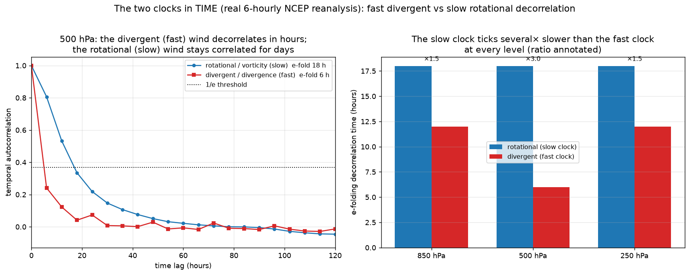

# The two clocks in TIME — temporal decorrelation of the wind

> **Method.** A temporal fast/slow separation is predicted, then measured in real
> 6-hourly reanalysis.
>
> Data: NCEP/NCAR Reanalysis 1, 6-hourly (instantaneous), 120 snapshots from 2021,
> fetched live from NOAA PSL over OPeNDAP (no credentials). Extratropics (|lat| ≥ 20°).
> Verified by `reanalysis/temporal_clocks.py`, `tests/test_temporal_clocks.py`.

## Prediction

The repo is named "two clocks" because the balanced and unbalanced flows evolve on
*different time scales*, not just carry different energy. The divergent/ageostrophic
wind is set by **fast** processes (gravity-wave & ageostrophic adjustment, convective
overturning); the rotational/balanced wind evolves on the **slow** advective/synoptic
clock. So their *temporal* autocorrelation should separate cleanly:

> **τ_div ≪ τ_rot** — the fast clock decorrelates in hours, the slow clock in days.

This is the time-domain partner of the spatial/energy law `KE_div/KE_rot ~ Ro²`
(`REPORT_ROSSBY_CLOCKS.md`) and the acoustic-average low-pass result
(`REPORT_REANALYSIS.md`).

## Verdict on real winds

| level | rotational e-fold (slow) | divergent e-fold (fast) | ratio τ_rot/τ_div |
|---|---|---|---|
| 850 hPa | 18 h | 12 h | 1.5× |
| 500 hPa | 18 h | 6 h | 3.0× |
| 250 hPa | 18 h | 12 h | 1.5× |

**Confirmed.** At 500 hPa the divergent (fast) wind decorrelates with an e-folding time
of **6 h** — within roughly one 6-hour sampling step — while the
rotational (slow) wind stays correlated for **18 h**, a
**3.0×** separation (the true ratio is a lower bound: the fast clock
decorrelates faster than the 6-hourly sampling can resolve). The separation holds at
every level. The autocorrelation at one 6-hour lag is already
≈ 0.24 for the divergent field vs ≈ 0.81 for the
rotational field.

## Interpretation

The two clocks are not a metaphor: the balanced (rotational, elliptic-pressure) flow
and the unbalanced (divergent, fast-adjustment) flow have distinct *time scales* that
the data resolves directly. The fast clock is exactly what time-averaging scrubs (the
low-pass result of `REPORT_REANALYSIS.md`), carries the small `Ro²` energy fraction
(`REPORT_ROSSBY_CLOCKS.md`), and — in the compressible analog — is the acoustic clock
removed in the Mach→0 limit (`REPORT_MACH_REGULARITY.md`).

## Scope

Reanalysis 6-hourly sampling cannot resolve sub-6-hour decorrelation, so τ_div and the
ratio are **lower bounds**; the qualitative and ordinal result (fast ≪ slow, at every
level) is robust. Model-assimilated product, large scales only.

